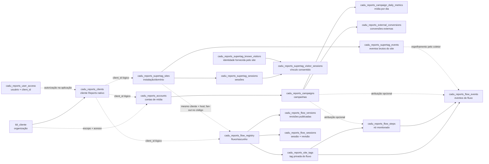
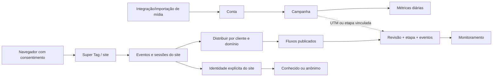

# Reports: mapa de dados de clientes, contas e fluxos

> Este documento registra o modelo anterior encontrado no código. A estrutura de destino, solicitada em 30/09/2026, remove `organization_id` do Reports e está no [plano centrado em client_id](reports-client-first-backend-plan.md). As recomendações de migração abaixo foram substituídas por esse plano, que considera o descarte dos dados de teste.

**Registro histórico:** código e migrações anteriores à refatoração v2. O [modelo implementado atualizado](reports-client-scope-v2-implementation.md) descreve a nova estrutura.

**Estado analisado:** código e migrações locais em 30/09/2026. Este é o modelo implementado no repositório; a aplicação das migrações e os volumes da base de produção não foram conferidos nesta análise. Linha contínua nos diagramas indica chave estrangeira ou associação materializada; linha pontilhada indica vínculo resolvido pela aplicação.

## 1. Identificadores e fronteiras

| Conceito | Identificador | Papel |
|---|---|---|
| Organização | `organization_id` = `tbl_cliente.id_cliente` | Dono do espaço e limite de autorização. |
| Cliente Reports | `client_id` | Subespaço de trabalho da organização. Pode apontar para um cliente legado `tbl_cliente` **ou** para `cadu_reports_clients.id`; não é um FK único. |
| Conta de mídia | `cadu_reports_accounts.id` | Conta de Google, Meta etc. Escopo `(organization_id, client_id)`; pode ter conta gerente como pai. |
| Campanha | `cadu_reports_campaigns.id` | Pertence a uma conta e ao mesmo escopo. |
| Site | `cadu_reports_supertag_sites.id` | Instalação da Super Tag para um domínio autorizado. |
| Fluxo | `cadu_reports_flow_registry.id` e `flow_code` | Diagrama editável/publicável; tem tag privada, rascunho e versão publicada. |
| Sessão | `ses nem resolve de qual tipo de cliente se trata. O acesso é verificado em `reports_access.py`; a tabelsion_id` | Navegação consentida no site; ao entrar em um fluxo, fica fixada à revisão publicada daquele fluxo. |

**Regra de leitura:** quase todas as consultas Reports exigem o par `(organization_id, client_id)`. Um `client_id` isolado não demonstra autorizaçãoa de permissões aceita IDs legados e nativos e, por isso, não tem FK direto para um cadastro único de clientes.

## 2. Mapa relacional atual



As FKs de conta → campanha, campanha → métricas, site → evento, fluxo → tag/versão/sessão e tag → etapa/evento usam, onde definido nas migrações, o escopo de organização e cliente. As ligações pontilhadas **não** são FKs entre as tabelas mostradas. Em especial, não há FK `supertag_site_id` no fluxo nem associação persistida site ↔ fluxo.

### Duas trilhas de dados



As métricas diárias de anúncios e os eventos de navegação são fatos diferentes. Mostrar o ícone “Meta Ads” num nó não prova que aquele nó esteja associado a uma conta Meta. O vínculo de campanha nos eventos depende de atribuição por UTM ou da campanha indicada na etapa; dados ausentes continuam sem campanha confirmada.

## 3. O que já existe

| Área | Tabelas/armazenamento | Comportamento atual |
|---|---|---|
| Acesso | `cadu_reports_clients`, `cadu_reports_user_access` | Cliente Reports nativo ou legado; resolução de autorização pela aplicação. |
| Operação de mídia | `cadu_reports_accounts`, `cadu_reports_campaigns`, `cadu_reports_campaign_daily_metrics`, `cadu_reports_source_runs`, `cadu_reports_ingest_keys` | Contas, hierarquia gerente/anunciante, campanhas e métricas por dia. Importações também têm arquivos, linhas e observações próprias. |
| Captação web | `cadu_reports_supertag_sites`, `cadu_reports_supertag_events`, `cadu_reports_supertag_sessions` | Instalação por domínio, eventos consentidos e sessões do site. |
| Identidade | `cadu_reports_supertag_known_visitors`, `cadu_reports_supertag_visitor_sessions` | Identificação explícita enviada pelo site; email/telefone são guardados como digest, não como texto. |
| Editor | `cadu_reports_flow_registry`, `cadu_reports_flow_versions` | Nós, arestas e grupos em JSONB; rascunho separado das revisões publicadas. |
| Coleta de fluxo | `cadu_reports_site_tags`, `cadu_reports_flow_steps`, `cadu_reports_flow_events`, `cadu_reports_flow_sessions` | Tag privada por fluxo, etapa por revisão, evento e sessão fixada à revisão. |
| Descoberta e disponibilidade | `cadu_reports_flow_discovery_runs`, `cadu_reports_flow_discovered_pages`, `cadu_reports_flow_monitor_checks` | Páginas descobertas e checagem HTTP. Disponibilidade HTTP não equivale a visitante online. |
| Capturas de páginas | Arquivos privados em `instance/reports-flow-previews` | Chave por organização, cliente e URL; não há tabela de captura, estado de processamento ou vínculo estável com nó. |

O evento consentido da Super Tag é espelhado para **cada** fluxo publicado do mesmo `(organization_id, client_id)` cujo `allowed_host` aceite o host da página. Cada cópia recebe a tag privada do fluxo, a revisão da sessão e, quando possível, a etapa correspondente. Isso permite mais de um fluxo observar o mesmo site, mas a política de inclusão fica implícita no código.

## 4. Exemplo de cardinalidade

```text
Organização Centralcomm (organization_id = O)
└─ Cliente Reports A (client_id = A)
   ├─ Conta gerente Google
   │  └─ Conta anunciante Google → campanhas → métricas diárias
   ├─ Conta Meta → campanhas → métricas diárias
   ├─ Site www.exemplo.com → eventos, sessões e identidades consentidas
   ├─ Fluxo “Institucional” → tag privada → revisões → etapas/eventos
   └─ Fluxo “Captura de leads” → outra tag privada → revisões → etapas/eventos
```

Um site pode alimentar dois fluxos do mesmo cliente. Uma conta pode conter várias campanhas. Um fluxo pode precisar mostrar várias contas/campanhas, mas **hoje não há associação explícita de conta a nó de origem**. O texto ou ícone do canal no diagrama é apresentação, não integração.

## 5. O que precisa mudar

| Prioridade | Lacuna atual | Mudança de dados e comportamento proposta |
|---|---|---|
| Alta | Site ↔ fluxo é inferido por cliente e host. Fluxos publicados elegíveis recebem cópias dos eventos, mesmo sem seleção explícita. | Criar `cadu_reports_flow_site_links(flow_id, site_id, organization_id, client_id, enabled, created_at)`, com FKs compostas e unicidade `(flow_id, site_id)`. Retropreencher apenas pares confirmados pelo domínio/configuração e expor seleção no editor. Fan-out passa a consultar esse vínculo. Preservar a possibilidade de um site alimentar vários fluxos. |
| Alta | Nós de origem paga não apontam para conta/campanha; o monitoramento pode sugerir uma atribuição que não foi verificada. | Criar `cadu_reports_flow_source_bindings` por `(flow_id, revision, node_id)` com `account_id` e `campaign_id` opcional, ambos validados no mesmo cliente. Permitir múltiplas campanhas por nó; guardar regra de atribuição e exibir “não vinculado” quando faltar ligação. Versionar junto do fluxo. |
| Alta | `client_id` aceita dois cadastros diferentes e não tem FK canônica nas tabelas Reports. | Definir uma entidade canônica de escopo Reports ou tabela de correspondência para cliente legado/nativo; migrar permissões e FKs em etapas, preservando IDs e autorização atuais. Não trocar IDs em produção por simples renomeação. |
| Média | A leitura de “online” do fluxo depende da revisão publicada atual; sessões fixadas em revisão anterior podem desaparecer do total após nova publicação. | Agregar sessões ativas por fluxo através das revisões e renderizar cada jornada em sua revisão original. Separar total online do site de presença sobre o desenho publicado. |
| Média | Capturas são arquivos indexados por hash da URL, sem registro de tarefa, validade ou falha. | Criar metadados de captura `(organization_id, client_id, site_id, URL normalizada, estado, capturada_em, validade, storage_key, erro)` e fila de atualização; o nó referencia a URL/site, podendo reutilizar a imagem. |
| Média | Identidade e filtros da audiência são associados por sessão/site, mas a seleção da interface pode operar sobre uma amostra limitada. | Paginar e filtrar no servidor sobre o conjunto completo; continuar exigindo identificação explícita e respeitar permissões e retenção. |
| Média | `cadu_reports_flow_monitor_checks` contém org/cliente, mas a FK de fluxo é apenas por `flow_id`; vínculos de projeto também exigem revisão do escopo. | Adicionar FK composta `(flow_id, organization_id, client_id)` e auditar todos os vínculos para impedir associações entre clientes. |
| Baixa | Conversões externas e fontes CRM são uma trilha paralela. | Definir contrato de integração por conta/cliente, deduplicação e consentimento antes de ligar conversões externas a nós do fluxo. API para CRM próprio permanece etapa futura. |

### Ordem de execução sugerida

1. Conferir as tabelas e contagens da base implantada; localizar vínculos legados e eventos sem revisão antes de migrar.
2. Materializar site ↔ fluxo, migrar os pares inequívocos e trocar o fan-out para a associação explícita.
3. Adicionar bindings de conta/campanha para nós de origem, com estados “vinculado” e “sem vínculo” no editor e monitor.
4. Corrigir agregação de sessões entre revisões e filtros de audiência no servidor.
5. Persistir metadados e fila das capturas; depois consolidar o cadastro canônico de cliente com migração de acesso cuidadosamente faseada.

## 6. Consultas de auditoria para a base implantada

Executar somente com acesso de leitura. Não coletar dados pessoais nem publicar resultados brutos.

```sql
-- Migrações/tabelas presentes (estrutura, não conteúdo).
SELECT to_regclass('public.cadu_reports_clients') AS clients,
       to_regclass('public.cadu_reports_accounts') AS accounts,
       to_regclass('public.cadu_reports_flow_registry') AS flows,
       to_regclass('public.cadu_reports_supertag_sites') AS sites;

-- Resumo por organização e cliente.
SELECT organization_id, client_id, COUNT(*) AS flows,
       COUNT(*) FILTER (WHERE status = 'published') AS published
FROM cadu_reports_flow_registry
GROUP BY organization_id, client_id
ORDER BY organization_id, client_id;

-- Fluxos publicados sem site no mesmo cliente/host (indício; verificar a regra de subdomínio).
SELECT f.organization_id, f.client_id, f.id AS flow_id, t.allowed_host
FROM cadu_reports_flow_registry f
JOIN cadu_reports_site_tags t ON t.id=f.tag_id
WHERE f.status='published'
  AND NOT EXISTS (
    SELECT 1 FROM cadu_reports_supertag_sites s
    WHERE s.organization_id=f.organization_id AND s.client_id=f.client_id
      AND s.enabled=TRUE AND s.revoked_at IS NULL
      AND s.allowed_host=t.allowed_host
  );

-- Eventos legados sem revisão comprovável.
SELECT organization_id, client_id, COUNT(*) AS events_without_revision
FROM cadu_reports_flow_events
WHERE flow_revision IS NULL
GROUP BY organization_id, client_id;
```

## Evidências no repositório

- Escopo e contas: `migrations/add_reports_native_clients_v1.sql`, `migrations/add_reports_operations_v1.sql`, `aicentralv2/cadu_connect/reports_access.py`.
- Site e identidade: `migrations/add_reports_supertag_v1.sql`, `migrations/add_reports_supertag_known_visitors.sql`.
- Fluxo e revisões: `migrations/add_reports_funnel_management_v1.sql`, `migrations/add_reports_flow_versions_v1.sql`, `migrations/add_reports_flow_integrity_v1.sql`.
- Distribuição dos eventos: `aicentralv2/cadu_connect/reports_supertag.py` (`_fanout_flow_events`).
- Capturas e observações anteriores: `aicentralv2/cadu_connect/reports_flow_previews.py`, `docs/reviews/reports-previews-audience-review-2026-09-30.md`.
