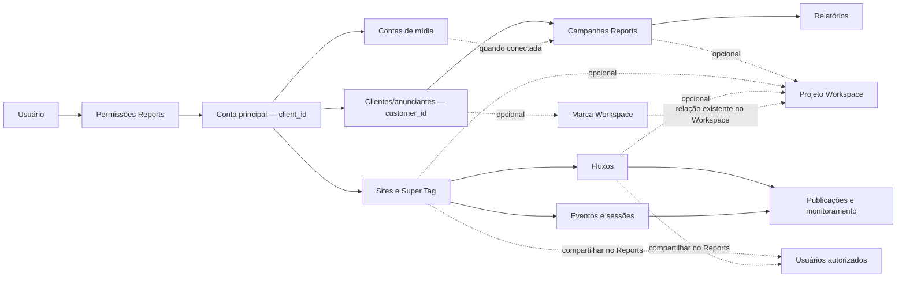

# Reports: operação independente com integração opcional ao Workspace

> Implementação local e limites desta entrega: [Reports v2](reports-client-scope-v2-implementation.md). Este documento conserva o plano completo; não deve ser interpretado como confirmação de execução de todos os itens.

Data: 30/09/2026. Estado: proposta revisada com a skill TypeSafe AI para implementação, baseada no código e nas migrações locais. Nenhuma alteração de banco foi executada nesta análise.

## 1. Decisão de estrutura

Remover `organization_id` do domínio Reports. Usar **`client_id` como identificador único da conta principal da plataforma**, validado pelo login e pela associação do usuário à conta. Abaixo dessa conta ficam clientes/anunciantes, campanhas, contas de mídia, sites, fluxos e relatórios. A integração com projetos e marcas Workspace é uma opção adicional, nunca uma etapa obrigatória.

Esta é a interpretação adotada para eliminar a ambiguidade: o `client_id` principal corresponde a `tbl_cliente.id_cliente`. Um cliente comercial atendido por uma agência recebe `customer_id` próprio em Reports. O mesmo usuário pode participar de vários `client_id`, e dentro de cada um administrar vários clientes, campanhas, contas, sites e fluxos.

“Conta de mídia” significa conta Google Ads, Meta Ads etc., identificada por `account_id`. Não criar outra camada obrigatória chamada organização ou outra conta intermediária com o mesmo papel de `client_id`.

| Campo | Significado definitivo | Origem |
|---|---|---|
| `user_id` | Pessoa autenticada | Login existente, `tbl_contato_cliente` |
| `client_id` | Conta principal proprietária dos dados | `tbl_cliente`, com associação Reports explícita do usuário |
| `customer_id` | Cliente/anunciante atendido dentro da conta principal | Cadastro independente do Reports |
| `account_id` | Conta de mídia externa | Cadastro e conexão do Reports |
| `workspace_project_ref` | Referência opcional de projeto | Workspace, somente quando o usuário escolhe vincular ou criar |
| `site_id` | Site monitorado | Cadastro Reports + instalação Super Tag |
| `flow_id` | Fluxo pertencente a um site | Reports |

O foco do produto é Super Tag, relatórios, monitoramento e fluxos. O ciclo completo de cadastro, coleta, publicação, análise e compartilhamento deve funcionar sem marca e sem projeto Workspace. Cliente/anunciante pode nunca vincular uma marca. Campanha pode pertencer somente ao cliente/anunciante no Reports, sem projeto. Sites e fluxos podem ser compartilhados por permissões próprias Reports e, opcionalmente, conectados a projetos Workspace.

Não criar projetos próprios Reports. Também não exigir projeto Workspace como substituto. Ausência de marca/projeto é um estado normal, sem alerta de cadastro incompleto, bloqueio ou redirecionamento obrigatório.

## 2. O que o código faz hoje e por que precisa ser trocado

`organization_id` não está inativo no código atual: participa das consultas, permissões, FKs, chaves de cache e escopos de ingestão. `reports_access.resolve()` depende de `cadu_family.context`; este obtém `organization_id` de `tbl_contato_cliente.pk_id_tbl_cliente`. Além disso, o `client_id` atual pode significar tanto cliente legado quanto cliente nativo de `cadu_reports_clients`.

A troca não é remover uma condição de SQL. É fixar a semântica de `client_id`, criar associação de usuários e reconstruir os relacionamentos abaixo dele. Não fazer substituição textual global de `organization_id` por `client_id`: hoje as duas colunas coexistem e têm significados diferentes.

Já existem contas de mídia em `cadu_reports_accounts`, incluindo gerente/anunciante, mas falta a gestão completa: cliente comercial associado, conexões, permissões, estado de sincronização e vínculo explícito aos nós dos fluxos.

## 3. Mapa proposto

Diagrama conceitual de propriedade e associações. As tabelas novas abaixo são propostas, ainda não implementadas.

Exemplo principal: uma agência cadastra Loja A no Reports, cria sua campanha, instala a Super Tag, publica um fluxo, compartilha o monitoramento com a equipe e gera relatórios. Nenhuma marca ou projeto é necessário. Uma conta de mídia pode ser conectada depois. Em outro momento, a agência pode vincular Loja A a uma marca e a campanha/site/fluxo a um projeto Workspace, mantendo os mesmos recursos e dados Reports.

Recursos da própria empresa podem ficar sem `customer_id`, apresentados como “Operação própria”. O cliente/anunciante é uma associação comercial, não substitui o limite de isolamento `client_id`.

## 4. Modelo de tabelas

Toda tabela proprietária de dados Reports carrega `client_id NOT NULL`. Recursos com `id` expõem `UNIQUE(id, client_id)` para FKs compostas. Relações filhas usam `(resource_id, client_id)` para impedir cruzamento entre contas principais. Recursos de alto volume podem repetir `client_id` por isolamento e índices; essa repetição tem função definida.

| Tabela proposta/ajustada | Campos e regras centrais |
|---|---|
| `cadu_reports_client_memberships` | `client_id`, `user_id`, `role`, `access_scope`, `status`, datas. PK `(client_id,user_id)`. FK para conta principal e usuário. Papéis `owner/admin/member/viewer`; escopo `all/selected`. |
| `cadu_reports_customers` | `id`, `client_id`, `name`, `slug`, `status`, contatos comerciais opcionais, `created_by`. Substitui `cadu_reports_clients`; unique `(client_id,slug)`. |
| `cadu_reports_customer_memberships` | `(customer_id,client_id,user_id)`, papel; FK ao cliente comercial e à associação principal. Permite equipe convidada acessar somente seu cliente. |
| `cadu_reports_accounts` | `id`, `client_id`, `customer_id` opcional, `platform`, `external_id`, `name`, `account_kind`, `parent_account_id`, moeda, fuso e status. Unique `(client_id,platform,external_id)`. Mantém a finalidade atual de conta de mídia. |
| `cadu_reports_site_grants`, `cadu_reports_flow_grants` | Grants tipados de recurso para usuário membro da conta principal, papel `viewer/editor`, autoria e revogação. Não exigem Workspace nem liberam outros recursos do cliente. |
| `cadu_reports_account_memberships` | `(account_id,client_id,user_id)`, papel; acesso direto a uma conta de mídia sem liberar todo o cliente comercial. |
| Projetos e marcas Workspace | Reutilizar entidades e referências canônicas do Workspace. Não criar `cadu_reports_projects`. |
| `cadu_reports_customer_workspace_brand_links` | `client_id`, `customer_id`, `brand_ref`, autoria e datas. Unique `(client_id,customer_id,brand_ref)`; permite várias marcas por anunciante. |
| `cadu_reports_campaign_workspace_links`, `site_workspace_links`, `flow_workspace_links` | Junções opcionais com `client_id`, recurso Reports, `project_ref`, `brand_ref` opcional, autoria e datas. Zero linhas significa operação exclusivamente Reports. Unique por recurso/projeto; permite uso em vários projetos. Validar escopo e acesso; validar marca/projeto somente quando houver contexto de marca explícito. Nenhuma FK obrigatória de campanha/site/fluxo para Workspace. |
| `cadu_reports_campaigns` | `id`, `client_id`, `customer_id` opcional para operação própria, `account_id` opcional, `external_id` opcional, `origin` (`manual/platform`) e metadados. Cliente comercial é vínculo direto. Campanha manual pode existir só com cliente/anunciante; campanha de plataforma exige conta e ID externo. Índice unique parcial `(account_id,external_id)` quando preenchidos. Validar compatibilidade com cliente da conta conectada. |
| `cadu_reports_connections` | `id`, `client_id`, provedor, estado, referência segura da credencial, erro sanitizado e datas de sincronização. Uma conexão pode expor várias contas. Segredos não ficam em JSON de conta/campanha. |
| `cadu_reports_connection_accounts` | Liga conexão às contas autorizadas com `client_id` em ambas as FKs. Revogar conexão interrompe coleta sem apagar histórico. |
| `cadu_reports_supertag_sites` | `id`, `client_id`, `customer_id` opcional, domínio canônico, estado, configuração. Continua sendo o site instalado; novas instalações recebem novo identificador público. |
| `cadu_reports_flow_registry` | `id`, `client_id`, **`site_id NOT NULL`**, nome, estado, rascunho e revisão publicada. Um site tem vários fluxos; um fluxo tem um site nesta versão. |
| `cadu_reports_flow_versions` | PK `(flow_id,revision)`, `client_id`, configuração imutável, autoria. Configuração mantém nós/arestas/grupos, com validação estrita de referências. |
| `cadu_reports_flow_source_bindings` | `client_id`, `flow_id`, `revision`, `node_id`, `account_id`, `campaign_id` opcional, regra de atribuição. Validar campanha na conta e nó na publicação. Permite múltiplas campanhas por origem. |
| `cadu_reports_flow_sessions` | `client_id`, `site_id`, `flow_id`, `session_id`, revisão fixada. FKs para sessão do site e versão; mantém sessão na publicação em que começou. |
| `cadu_reports_flow_observations` | `client_id`, `site_id`, `flow_id`, `revision`, `source_event_id`, `node_id` opcional. Unique `(flow_id,source_event_id)`; associação idempotente ao evento original, sem nova cópia de todos os seus campos. |
| `cadu_reports_page_previews` | `id`, `client_id`, `site_id`, URL normalizada/hash, estado, chave privada de arquivo, validade e erro. Unique `(site_id,url_hash)`. Tarefa de captura explícita, repetição controlada e recaptura quando arquivo faltar. |
| `cadu_reports_audit_events` | `client_id`, ator, ação, entidade, instante e metadados limitados. Registra acesso concedido/revogado, conexões, publicações e alterações administrativas. |

O cadastro Reports nunca valida marca/projeto quando nenhum vínculo Workspace foi solicitado. Se uma conta de mídia já pertencer a um anunciante, associar campanha a essa conta exige cliente comercial compatível; campanha manual continua válida sem conta de mídia. Contas gerentes podem ter anunciantes diferentes, mas acesso ao gerente não libera automaticamente suas contas filhas.

Recursos sem `customer_id` representam operação própria. Podem ser acessados por membros com escopo geral ou por grant direto ao recurso; não são liberados apenas por convite para outro anunciante.

Compartilhar site/fluxo significa conceder acesso à mesma entidade, sem duplicar instalação, eventos ou métricas. Um site pode alimentar vários fluxos; um fluxo pode aparecer em vários projetos opcionais. Manter um site por fluxo nesta etapa é uma decisão de coleta, não uma restrição de compartilhamento. Suporte a fluxo multidomínio é evolução distinta e não é inferido deste pedido.

## 5. Eventos, fluxos e monitoramento

Manter a Super Tag como entrada única dos eventos web. O coletor resolve `site_id` e `client_id` pelo identificador público da instalação; jamais aceita `client_id` informado pelo navegador para escolher a conta de destino.

1. Validar instalação, domínio, consentimento e limite de coleta.
2. Persistir uma vez em `cadu_reports_supertag_events`, com unique `(site_id,event_id)`.
3. Localizar fluxos publicados por `flow_registry.site_id`, eliminando a inferência atual por cliente + domínio.
4. Fixar cada sessão à sua versão, resolver a etapa e gravar observação idempotente.
5. Consultar a audiência do site e as observações do fluxo com seus escopos. Nunca somar visitantes de vários fluxos para obter usuários únicos do site.

Isso substitui, no caminho principal, a tag privada por fluxo e o espelhamento integral em `cadu_reports_flow_events`. `cadu_reports_site_tags` deixa de ser requisito do modelo novo. Tokens antigos de tags de fluxo são invalidados no reset, e o editor copia a instalação do site. Eventos simulados continuam separados dos eventos reais.

Os eventos originais permanecem fonte de verdade. Observações guardam classificação da publicação; expurgo remove observações antes dos eventos ou usa FKs com política de remoção deliberada. Eventos e sessões devem compartilhar o mesmo site via FK composta, além de `client_id`.

Preservar as seis correções recentes: captura isolada por contexto, timeout, regeneração única, cache recuperável, audiência entre publicações e filtro de identificação antes do limite. Ao vivo global do fluxo considera todas as sessões fixadas ainda ativas; presença e conexões animadas do mapa usam somente a revisão exibida. Identificação continua explícita e restrita ao site, sem fundir pessoas por aproximação de dados.

## 6. Acesso, equipe e gestão de contas

Substituir `reports_access.resolve()` por contexto próprio: `{user_id, client_id, role, access_scope}`. Remover dependências de `cadu_family.context.authorized_clients()`, `context.resolve()` e `context.require_admin()` do núcleo Reports.

- Usuário autenticado pode ter múltiplas associações em `cadu_reports_client_memberships`; cada seleção é revalidada no servidor.
- `owner/admin` administra a conta principal; impedir a remoção do último proprietário ativo.
- `member/viewer` com escopo geral acessa os recursos da conta conforme seu papel. Com escopo selecionado, depende de vínculo ao cliente comercial ou à conta de mídia.
- Acesso por cliente comercial se propaga para seus sites, fluxos e contas Reports. Projetos e marcas continuam exigindo permissão Workspace. Acesso direto a conta de mídia libera essa conta e campanhas, mas não sites/fluxos de outro escopo.
- Campanhas exigem acesso ao anunciante/escopo Reports e, quando conectadas, à conta de mídia pertinente. Campanhas manuais não exigem conta de mídia. Vínculo a projeto não concede nenhum desses acessos.
- Compartilhar site ou fluxo usa grants Reports tipados. Para convidado novo, criar associação principal com escopo selecionado, sem acesso geral. Grant de fluxo libera seu desenho e as métricas autorizadas, mas não o inventário/eventos brutos do site nem fluxos irmãos. Grant de site não libera outros clientes ou contas; edição e publicação exigem capacidades próprias. Projetos usam permissões Workspace.
- Filtros de URL/body são seleção, não autorização. Leituras, exportações, imagens, jobs e operações em lote passam pela mesma política.

Reutilizar autenticação/CSRF existente. O atributo global `reports_only` requer auditoria dos consumidores: substituí-lo no caminho Reports por permissões da solução, sem alterar unilateralmente o acesso do usuário aos demais produtos.

A gestão de contas deve priorizar cliente comercial, plataforma, identificação externa, gerente, equipe, conexão e última coleta. Projetos opcionais aparecem na área de integrações. A conexão recebe credenciais separadamente; criar conta manual não implica que ela já coleta dados.

## 7. Integração com marcas e projetos Workspace

A integração é acessada por ação secundária “Vincular ao Workspace”. Ela não é solicitada para criar cliente, campanha, site, fluxo, relatório ou publicar/monitorar. Formulários principais não exigem `brand_ref` nem `project_ref`.

Cliente/anunciante pode vincular zero, uma ou várias marcas. Campanhas, sites e fluxos podem ter zero ou vários projetos associados. Ao selecionar explicitamente uma marca, filtrar e validar projetos por `cadu_family_project_brands`. Sem contexto de marca, permitir projeto acessível da mesma conta sem obrigar a criar marca, respeitando as regras canônicas Workspace. Não associar marca automaticamente ao anunciante por dedução do projeto.

Sites e fluxos oferecem “Vincular a projeto existente” e “Criar projeto no Workspace” somente quando o usuário escolhe essa integração. Publicação e monitoramento funcionam sem vínculo. Projetos vinculados ao site podem ser sugeridos ao fluxo, mas sua associação é explícita; compartilhar ou vincular um recurso não propaga acesso automaticamente. Mudanças de associação não reescrevem o histórico.

Fluxo opcional de criação integrado:

1. Usuário solicita criar projeto a partir de site/fluxo. Resolver conta, recurso e marca somente se informada.
2. Validar permissão Reports e permissão de criar no Workspace, incluindo limites de plano. Falta dessa capacidade bloqueia somente a integração solicitada.
3. Criar pelo serviço canônico Workspace, com proprietário e referência canônica, sem tabela paralela Reports.
4. Associar ao recurso Reports e, se escolhida, à marca. Usar chave idempotente; repetição retorna o mesmo projeto.
5. Exibir “Abrir no Workspace”. No projeto, mostrar recursos Reports conforme as permissões do usuário.

A criação existente no repositório usa `idempotency_key` e confirma a própria transação; a associação marca/projeto também confirma separadamente. Extrair um serviço que aceite a transação do chamador quando tudo usar o mesmo banco. Se não for possível, persistir uma operação recuperável com estados `pending/project_created/linked/failed`; retomar vínculos pendentes sem duplicar projeto. Não excluir automaticamente projeto preexistente ou já usado como compensação.

Adicionar `cadu_reports_workspace_operations` com `client_id`, ator, chave idempotente única no escopo, hash do pedido, recurso de origem, referência criada, estado e erro sanitizado. Reuso da chave com payload diferente retorna conflito; em retomadas, revalidar permissões e estado do recurso.

Remover um vínculo Reports não remove marca/projeto Workspace. Projeto arquivado, exclusão ou perda de acesso torna o vínculo indisponível e impede novas operações integradas; coleta e histórico Reports continuam. Mudanças na relação marca/projeto exigem revalidação dos vínculos. Não revelar título, marca ou conteúdo de projeto privado a quem só tem acesso Reports.

Para referências polimórficas como `ci:...`, usar o resolvedor canônico e validar tipo, conta e acesso. Aplicar FK tipada onde a estrutura suportar; não declarar uma FK universal inexistente. A fronteira da integração recebe `client_id`; adaptação de campos legados internos do Workspace permanece no serviço compartilhado.

## 8. Troca do backend por área

| Área e arquivos atuais | Trabalho necessário |
|---|---|
| `reports_access.py` | Reescrever resolução, seleção, listagem de contas principais e grants. Trocar criação de cliente nativo por cadastro `customers`; associação inicial do proprietário por mecanismo explícito de provisionamento. |
| `reports_v1.py` | Trocar `_selection`, filtros e guards; CRUD de clientes, contas e equipe; catálogo de projetos por marca e permissão. `_visible_workspace_projects` passa ao serviço integrado de vínculos e criação Workspace. Alterar respostas de bootstrap. |
| `reports_ingest.py` | Chaves/conexões ligadas a `client_id` e contas permitidas; validar conta → campanha de plataforma; preservar campanha manual sem conta; revisar idempotência e contas gerente. Não aceitar escopo arbitrário do payload. |
| `reports_imports.py` e auxiliares | Migrar arquivos, linhas, observações, decisões, mapas, dimensões, projeções e snapshots. Propagar `client_id`, cliente/anunciante e conta quando houver até os workers. Projeto é filtro/contexto opcional e não condição de importação. |
| `reports_supertag.py` | Site como raiz de coleta, resolução pública, sessões/identidade, observações de fluxo idempotentes; remover fan-out por domínio e tag privada. |
| `reports_flow.py`, `reports_flow_versions.py` | Fluxo com site obrigatório, bindings de origem, validação de referências e política de publicar; reescrever consultas de jornada para eventos + observações. |
| `reports_flow_live.py` | Agregação por fluxo/revisão com fonte de eventos nova; manter sessões antigas ativas, filtros e limites explícitos. |
| `reports_flow_monitor.py`, `reports_flow_suggestions.py` | Checks, descoberta e sugestões vinculados ao site/fluxo e `client_id`; jobs carregam escopo persistido e revalidam estado do recurso. |
| `reports_flow_previews.py` | Cache `client_id/site_id/URL`; tabela de metadados e tarefa; permissões nas imagens; descartar namespace antigo no reset. |
| `reports_link_tester.py`, `report_workspace.py`, documentos e versões | Atualizar propriedade, links públicos, projetos opcionais e referências legadas. Examinar view `cadu_planner_link_test_runs` antes de qualquer remoção. |
| Scripts `audit_reports_v1.py`, `prune_reports_events.py`, `purge_reports_supertag_events.py` | Atualizar inventário, retenção, relações novas e escopo dos jobs. Auditar também workers e registradores externos a esses arquivos. |
| Frontend Reports | Bootstrap e seleção cliente/conta separados; projetos na integração opcional, URLs e caches completos; formulários de gestão e vínculos Workspace opcionais. Invalidar requisições e seleções ao trocar conta principal. |
| Navbar e créditos compartilhados | Consultar identidade/créditos pelo `client_id` principal; adaptar a fronteira compartilhada sem alterar o modelo de outros produtos. |

Revisar igualmente funções SQL, views, índices, constraints, trilhas de auditoria, storage, logs estruturados, tarefas recorrentes, tokens públicos e documentação. Migrações históricas podem continuar contendo `organization_id`; a base final e o código ativo de Reports não devem depender dele.

## 9. Contratos novos de API

Publicar o contrato em `/connect/api/v2/reports` para impedir que o `client_id` antigo seja interpretado silenciosamente com significado novo.

| Recurso | Contrato proposto |
|---|---|
| Contexto | `GET /context`: contas principais autorizadas, conta selecionada e capacidades; `client_id` sempre conta principal. |
| Clientes comerciais | `GET/POST /customers`, `PATCH /customers/{id}` |
| Contas de mídia | `GET/POST /accounts`, `GET/PATCH /accounts/{id}`, equipe e conexões como subrecursos |
| Projetos Workspace (opcional) | `GET /workspace/projects` com `brand_ref` opcional; `POST /workspace/project-operations` com recurso, chave idempotente e marca opcional; consultar estado. |
| Campanhas | `GET/POST /campaigns`, `PATCH /campaigns/{id}`; cadastro manual por cliente/anunciante, sem marca/projeto/conta de mídia obrigatórios; origem de plataforma exige conta. |
| Compartilhamento Reports | `GET/POST/DELETE /sites/{id}/grants` e `/flows/{id}/grants`; papéis e revogação, sem contexto Workspace. |
| Sites | `GET/POST /sites`, detalhe, instalação, estado e conexões |
| Fluxos | `GET/POST /sites/{site_id}/flows`, `GET/PATCH /flows/{id}`, publicar, versões, jornada, ao vivo e bindings |
| Equipe | `GET/POST /memberships`, grants por cliente e conta; revogação explícita |
| Workspace | Marcas acessíveis, vínculo anunciante/marca, vínculos tipados de campanha/site/fluxo com projeto e retorno de recursos integrados no projeto |

Todas as rotas privadas resolvem `client_id` da seleção validada. Um ID de recurso fora do escopo não retorna dados. Filtros `customer_id`, `account_id`, `workspace_project_ref` são independentes e coerentes entre si. No frontend, a chave do cache inclui esses filtros quando afetam a resposta, além de `client_id`, recurso e revisão. As rotas públicas da Super Tag podem manter caminho estável, mas antigas instalações revogadas devem receber resposta explícita e não serem reaproveitadas.

## 10. Reset dos dados de teste e implantação

O usuário autorizou descartar os dados de teste de Reports. Aproveitar isso para evitar conversão ambígua de clientes antigos. A execução deve reconstruir o domínio Reports com escopo novo; esta análise entrega o plano e não executa o reset.

1. Produzir inventário real de tabelas, FKs entrantes, views, jobs, storage e consumidores compartilhados. Manter lista nominal de objetos autorizados para reset, sem `DROP ... CASCADE` genérico.
2. Gerar backup de recuperação e registrar versão implantada. Suspender escritores, workers, coletores e importações Reports durante a troca.
3. Distinguir objetos exclusivos de Reports dos compartilhados. Preservar `tbl_cliente`, usuários, autenticação, créditos, faturamento, Workspace, marcas, projetos e Planner. A view do Link Tester e suas dependências exigem tratamento explícito antes de remover a tabela de origem.
4. Remover os dados de teste e substituir o esquema Reports pelo contrato novo. Criar migração de transição e baseline para instalações novas; não editar migrações antigas como se já não tivessem sido aplicadas.
5. Provisionar associação do proprietário a `client_id` existente a partir de identidade validada. Inicializar Reports vazio, sem IDs artificiais na faixa de 1 bilhão nem cliente legado/nativo misturados.
6. Implantar backend e frontend v2 juntos; aposentar rotas privadas v1 com resposta orientando recarregamento durante a transição. Não manter dois escritores com semânticas distintas.
7. Invalidar tokens/instalações Reports de teste, limpar somente o cache Reports antigo e gerar nova instalação para cada site cadastrado. IDs públicos antigos não podem atingir novos recursos.
8. Reativar workers e coleta, conferir o ciclo cliente → campanha/relatório e site → tag → fluxo → evento → monitoramento, inteiramente sem Workspace, depois verificar compartilhamento e integração opcional. Rollback restaura código e banco da mesma versão; restaurar só o código não é suficiente.

## 11. Fases e critérios de conclusão

| Fase | Entrega | Critério para avançar |
|---|---|---|
| 1 — Escopo e esquema | Memberships, customers, contas, referências Workspace e inventário do reset | Usuário com duas contas principais alterna corretamente; referências cruzadas são rejeitadas por aplicação e FKs. |
| 2 — Gestão | APIs e telas de clientes, campanhas manuais, contas, conexões e equipe | Operação própria e cliente comercial funcionam; campanhas funcionam sem marca/projeto/conta de mídia; convites têm escopo real. |
| 3 — Operação de mídia | Ingestão, imports, campanhas e relatórios | Cada campanha pertence ao anunciante/escopo correto; campanhas de plataforma validam conta; reenvio não duplica métricas; coleta pode operar sem projeto vinculado. |
| 4 — Sites e fluxos | Fluxo com site explícito, versões, bindings e observações | Evento entra uma vez; dois fluxos recebem observações próprias; nós Google/Meta mostram vínculo confirmado ou ausência. |
| 5 — Monitoramento e capturas | Ao vivo, identidade, filtros, checks e capturas | Seis correções recentes preservadas; troca de contexto não mostra dados anteriores; captura apagada se recupera. |
| 6 — Integração Workspace e virada | Compartilhamento Reports, pontes Workspace opcionais, reset e deploy | Reports opera sem vínculo Workspace; remover vínculo não remove recurso; tokens antigos não coletam em recursos novos. |

Verificações necessárias na implementação: integração SQL em base descartável, testes de autorização com dois `client_id` e vários usuários, FKs de escopo, coleta pública, idempotência, publicação concorrente, retenção e jobs; testes de interface para troca de conta, cadastro e monitoramento. Incluir cadastro com zero dados e usuário convidado restrito. As verificações devem cobrir comportamento e limites entre contas, não apenas procurar nomes de colunas.

## 12. Resultado esperado

`client_id` identifica sempre o proprietário. `customer_id` organiza clientes/anunciantes; `account_id` identifica contas de mídia; `workspace_project_ref` aponta ao projeto canônico do Workspace. Sites têm fluxos explicitamente ligados, e eventos têm uma origem rastreável. As ferramentas se integram por marca e projeto; os vínculos são opcionais durante todo o ciclo do produto. `organization_id` deixa de existir no contrato e na estrutura ativa de Reports, sem transferir sua antiga função de isolamento para um campo ambíguo.

## 13. Revisão TypeSafe AI — achados corrigidos

Aplicada a skill local e consultados o [índice oficial](https://docs.typesafe.ai/llms.txt) e a documentação de [State](https://docs.typesafe.ai/concepts/state). A revisão confrontou requisitos, relacionamentos e permissões observados no código. Não houve avaliação remota Jev nem probabilidades atribuídas aos achados. Regras de acesso e vínculos são determinísticas.

| Achado no plano anterior | Correção |
|---|---|
| P1: inventava projetos próprios do Reports | Projeto canônico único no Workspace; removidos tabela e CRUD paralelos da proposta. |
| P1: projeto selecionado sem garantir relação com a marca do anunciante | Validar anunciante → marca e marca → projeto, na mesma conta principal. |
| P1: falha entre criar projeto e vincular podia duplicar ou deixar operação incompleta | Serviço transacional ou operação recuperável, chave idempotente e retomada. |
| P1: associação podia ser interpretada como concessão de acesso | Exigir acesso nas duas pontas. Papel efetivo nunca supera as permissões de cada ferramenta. |
| P2: integração era apenas uma ponte externa | Seleção/criação a partir de Reports e navegação de retorno no projeto Workspace. |
| P2: reset podia atingir recursos criados pela integração | Reset remove apenas Reports e suas pontes; preserva projetos e marcas Workspace, inclusive os criados a partir do Reports. |

Casos de aceite: anunciante com duas marcas; projeto com várias marcas; projeto de outra conta/marca; usuário só Reports; usuário sem direito de criar projeto; limite do plano; reenvio após timeout; falha entre criar e vincular; remoção de acesso; projeto arquivado; nova publicação sem duplicação de projeto; reset Reports preservando recursos Workspace.

Evidências: `aicentralv2/cadu_family/repository.py` (`project_brand_links`, `set_project_brand_link`, criação idempotente e `project_user_can_view`), `aicentralv2/cadu_family/routes.py` (validação de marca/projeto) e `aicentralv2/cadu_connect/reports_v1.py` (`_visible_workspace_projects`). Este documento é plano de execução; a integração ainda não foi alterada no produto.

## 14. Correção de escopo — funcionamento integral sem Workspace

Esta revisão substitui qualquer leitura das seções anteriores que transforme integração em sequência obrigatória. Critério principal: um usuário só Reports consegue cadastrar cliente/anunciante e campanha manual, instalar tag, criar/publicar fluxo, compartilhar, monitorar e gerar relatório sem marca, projeto ou acesso Workspace.

Prioridade de execução: isolamento por `client_id` e clientes/campanhas → Super Tag e dados → fluxos/relatórios/monitoramento → compartilhamento → integração Workspace opcional. O núcleo não consulta disponibilidade de projetos ou marcas para autorizar operação Reports; indisponibilidade de Workspace não bloqueia seus endpoints nem workers.

Compartilhamento inicial é entre usuários autorizados na mesma conta principal. Compartilhar com destinatário externo requer convite e grant restrito nessa conta; não reutilizar dados de outro `client_id`. Links públicos, se habilitados futuramente, devem ser somente leitura, revogáveis e com visão limitada; não estão automaticamente autorizados pelo cadastro de um vínculo Workspace.

Aceite obrigatório adicional:

- Cliente sem marca permanece válido e utilizável indefinidamente.
- Campanha manual ligada ao cliente funciona sem projeto ou conta de mídia; conexão posterior preserva sua identidade e histórico e valida duplicidade externa.
- Publicar fluxo e gerar relatório não dispara criação de projeto.
- Site e fluxo podem ser compartilhados sem Workspace; revogação remove acesso inclusive às imagens, exportações e atualização ao vivo.
- Compartilhar fluxo não revela eventos de outros fluxos, clientes ou sessões fora de sua visão.
- Vincular/remover projeto não duplica métricas nem muda propriedade ou permissões Reports.
- Marca ausente e projeto ausente são estados normais; erro na integração aparece apenas na ação solicitada.
- Relatórios, coleta e monitoramento continuam com Workspace indisponível.

A matriz TypeSafe da revisão anterior permanece registro dos problemas encontrados; a validação anunciante/marca/projeto só se aplica quando esse contexto é escolhido explicitamente. Não é requisito de cadastro Reports.
