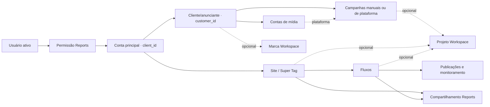

# Reports — conta principal e integrações opcionais

Estado: implementação local em `main`, em 30/09/2026. Banco de produção não alterado. Backend e bundle devem ser implantados junto com a migração.

## Modelo implementado

- `client_id` identifica `tbl_cliente.id_cliente`, validado contra `cadu_reports_client_memberships` e usuário ativo em cada requisição.
- `customer_id` identifica `cadu_reports_customers`. Pode ficar vazio para operação própria. Não é conta principal nem projeto.
- Clientes, campanhas e contas têm gestão própria na interface Reports. Campanha manual dispensa conta de mídia, marca e projeto; a conexão posterior preserva o ID e valida anunciante e duplicidade.
- Um fluxo tem `site_id` obrigatório. A distribuição de eventos usa esse vínculo explícito, além do domínio autorizado. O evento original é registrado em `source_event_id`, com unicidade por fluxo/tag para impedir duplicidade.
- As estruturas internas de tags/etapas e eventos de fluxo continuam como projeção operacional utilizada pelo editor e histórico. A migração não as substitui por um motor de observações inteiramente novo.
- Capturas têm namespace v2 com conta principal e site. As correções anteriores de cancelamento, contexto, recaptura e monitoramento entre revisões foram preservadas.
- Não existe projeto próprio Reports.

## Contratos e permissões

APIs privadas usam `/connect/api/v2/reports`. Chamadas privadas v1 recebem 410 e orientação para recarregar. Coletores públicos da Super Tag, ingestão e tag de fluxo mantêm seus caminhos; as credenciais anteriores deixam de valer após o reset.

Papéis de conta: `admin`, `member`, `viewer`. Escopo geral: `all`. Convidado de recurso: `shared`, somente leitura. Não se concede acesso ao Workspace por consequência de um grant Reports.

Compartilhamento de site permite consultar seu resumo e seus fluxos. Compartilhamento de fluxo permite consultar somente esse fluxo, jornada, atualização ao vivo e capturas autorizadas. O convidado não acessa APIs de inventário da conta, credenciais, edição ou publicação. Revogação é conferida novamente nas consultas.

`reports_only` permanece como atributo legado da autenticação compartilhada; a gestão Reports não muda esse atributo nem os direitos do usuário em outros produtos. A seleção Reports usa sessão própria e não troca a seleção Workspace.

## Workspace opcional

A ação **Vínculos** consulta marcas/projetos apenas quando solicitada. Clientes podem vincular marcas; campanhas, sites e fluxos podem vincular vários projetos. Sites/fluxos também podem criar um projeto usando o serviço canônico Workspace.

Criação e vínculo usam a mesma transação. Chave idempotente está vinculada ao conteúdo do pedido e ator; reutilização com conteúdo diferente retorna conflito. Limites de plano e acesso Workspace continuam aplicados. Desvincular não exclui o projeto ou marca.

O bootstrap, cadastro de campanhas, geração de relatórios, coleta e monitoramento não consultam o inventário Workspace. Leitores de relatórios no Workspace verificam também a permissão Reports.

## Migração e implantação

Arquivo: `migrations/reset_reports_client_scope_v2.sql`.

1. Fazer backup recuperável e suspender escritores/coletores/workers Reports.
2. Aplicar uma vez a migração sobre a base com as migrações anteriores de Reports instaladas.
3. Implantar backend e bundles da mesma revisão; reiniciar aplicação e workers.
4. Cadastrar os dados definitivos e emitir novas instalações/chaves.
5. Conferir o fluxo completo na instalação de destino antes de liberar a operação.

A migração contém uma lista nominal de tabelas Reports, bloqueia dependências externas não previstas e executa dentro de transação. Reconstrói constraints, índices e a projeção de importações sem `organization_id`. Uma segunda execução é recusada para impedir outro reset acidental.

Preserva identidade, Workspace, Planner e registros compartilhados do Link Tester. Limpa as associações destes últimos aos dados Reports descartados. O rollback exige restaurar banco e código correspondentes.

## Evidência local

Conferência feita em PostgreSQL 17 descartável, com tabelas compartilhadas mínimas e esquema Reports montado pelas migrações históricas:

- Migração v2 concluída.
- 346 consultas SQL literais preparadas contra o esquema resultante, sem erro de coluna, relação ou tipo.
- Bootstrap da conta autorizada retornou 200; seleção de outra conta retornou 403.
- Cadastro de anunciante, campanha manual sem Workspace, conta de mídia e fluxo retornou 201.
- Publicação do fluxo concluída; coleta repetida do mesmo evento preservou uma única projeção.
- Consultas de atividade, jornada, usuários ao vivo, métricas e sites concluídas.
- Compartilhamento concedeu leitura ao convidado, bloqueou escrita e passou a retornar 403 após revogação.
- Campanha manual foi conectada depois à conta de mídia; relatório criado sem projeto.
- O ciclo principal foi executado com a tabela de projetos Workspace indisponível na base descartável.
- Bundle React compilado. Não houve inspeção visual em navegador nem deploy nesta etapa.

Essa conferência não substitui homologação contra o esquema completo e as permissões Workspace reais da instalação de destino. Credenciais/conexões de CRM e permissões finas por anunciante/conta de mídia não foram adicionadas nesta entrega; a gestão implementada usa conta principal e grants de site/fluxo.

## Fechamento da revisão — 30/09/2026

- Revogação da conta remove os grants de sites e fluxos na mesma transação. Reativação remove grants legados de participações revogadas antes de conceder o recurso solicitado.
- Operação de criação já concluída restaura o vínculo opcional com o projeto. O formulário usa uma chave UUID estável durante tentativas da mesma operação, independente do tamanho do nome.
- O catálogo Workspace coleta sites, fluxos e campanhas da nova tabela de vínculos. A interface abre o destino no Reports. Listas, busca e relações verificam a autorização Reports; vínculo Workspace não concede autorização.
- Convidados têm seletor de contas também na visualização de monitoramento.
- Bundles Reports e Workspace reconstruídos; assets antigos preservados para sessões com cache.

Verificações desta correção: banco PostgreSQL descartável com chamadas Flask reais confirmou que o fluxo revogado continua retornando 403 após compartilhar outro fluxo. O ciclo desvincular/repetir criação restaurou exatamente um vínculo; consultas reais coletaram os três tipos de recurso. Nessas verificações de vínculos, a autorização Workspace foi simulada, sem homologação no banco de produção. Compilações Vite e análise de sintaxe Python concluídas. Nenhuma migração ou reinicialização foi executada no servidor nesta etapa.
