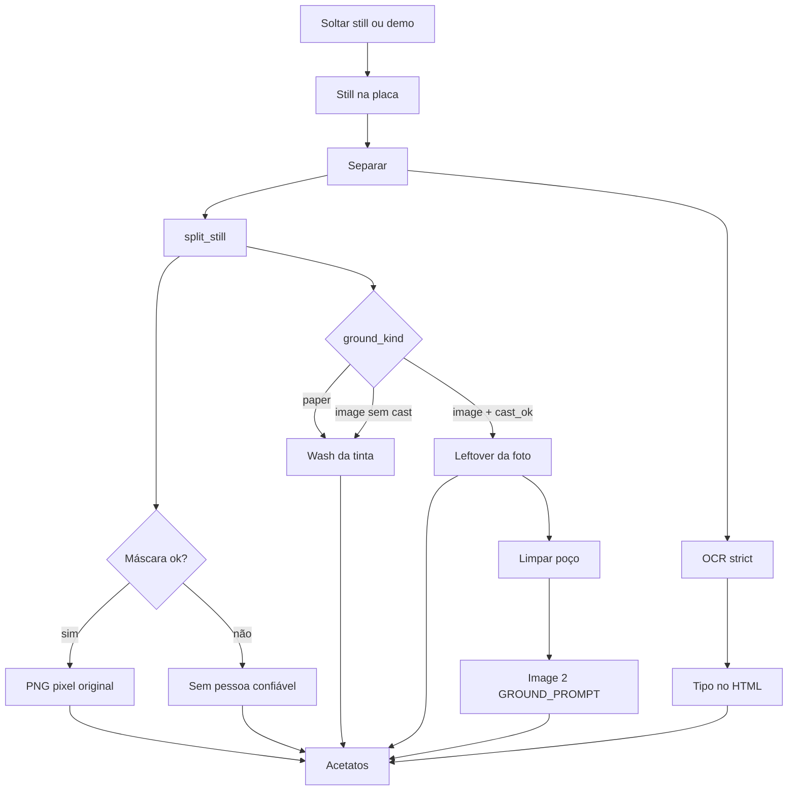

# Camadas — spec de rebuild

Spec da tela `https://ai.centralcomm.media/parametros/modelagem-criativos/camadas` para refazer a mesa depois. Fonte da verdade: o código em 2026-09-13, não o `docs/camadas.md` antigo (caches e contrato de lab ficaram atrás).

Documento operacional atual: [`docs/camadas.md`](camadas.md). Lab: [`docs/camadas-lab/state.md`](camadas-lab/state.md). Trocr: [`docs/trocar.md`](trocar.md).

A tela **não persiste**. Still, acetatos e copy ficam na sessão do browser. Recorte e OCR rodam de novo a cada Separar.

---

## 0. Contrato que a rebuild tem de manter

Híbrido. Três saídas, nunca uma só:

| Saída | O que é | O que não é |
|---|---|---|
| **Pessoa** | PNG do pixel original, só se o gate da máscara passar | Image 2 não redesenha rosto. Tipo não vira recorte. |
| **Tinta** | Wash sólido da cor medida (papel) ou leftover / poço Image 2 (foto) | JPG menos um buraco no papel TIM. |
| **Tipo** | Chips HTML: headline, apoio, preço, CTA, logo | PNG de glifo. Headline nunca entra no acetato. |

Regras fechadas:

1. Image 2 **só** limpa poço de foto (`ground_kind == image`). Em papel a tinta já é o wash.
2. Image 2 **nunca** recorta pessoa. `CAST_PROMPT` existe em `decompose.py` e está morto.
3. Sem pessoa confiável a mesa admite o limite. Não “completa” o elenco com modelo.
4. HTTP não aceita callables (`predictor`, `text_callable`, `image_callable`).
5. `operation_id` ecoa; resposta atrasada é lixo.
6. Tipo no HTML é OCR slim. Bloco completo fica em `read_full` para o lab, não na UI.

---

## 1. Onde vive

| Peça | Valor |
|---|---|
| URL | `/parametros/modelagem-criativos/camadas` |
| Blueprint | `parametros` (`url_prefix=/parametros`) |
| Desk | `MC_DESKS["camadas"]` em `creative_modeling_routes.py` |
| Título do chrome | Camadas do still |
| Lead do chrome | Pessoa só se o recorte for fiel. Papel vira wash. Headline e CTA ficam no HTML. |
| Título do painel | O still vira acetato |
| Auth página | `admin_required` |
| Auth JSON | `admin_required_api` |
| CSS | `static/css/modelagem_criativos.css` bloco `.mc-layers*` — cache desk `?v=110` |
| JS | `static/js/mc-camadas.js` + `mc-desk-brand.js` — cache compartilhado `?v=71` |
| Painel | `templates/parametros/_mc_camadas.html` |
| Shell | `templates/parametros/_mc_shell.html` — link Camadas no grupo lab |

Envelope JSON: `{ "success": true, "data": ... }` ou `{ "success": false, "error": "..." }`. `credentials: "same-origin"`.

---

## 2. Inventário da UI (o que a rebuild substitui)

### 2.1 Copy fixa

| Superfície | Texto |
|---|---|
| H2 | O still vira acetato |
| Lead | Pessoa só sai se o recorte for confiável. Papel vira wash da tinta. Headline, preço e CTA entram no HTML — não no PNG. |
| Engine default | Python · recorte |
| Tally | Still → Pessoa → Tinta |
| Drop título | Solte o criativo |
| Drop apoio | Ou abra o still de teste. PNG, JPG ou WEBP. |
| CTA 1 | Separar |
| CTA 2 | Limpar poço (hidden até `ground_kind == image`) |
| CTA 3 | Abrir criativo de teste |
| Rack | Acetatos |
| Status vazio | Solte um still. A pessoa sai em PNG. A tinta vira o campo. O tipo fica no HTML. |
| Status com still | Still na placa. Separe pessoa, tinta e copy. |
| Status python | Recortando no Python. |
| Status image | Limpando o poço da foto. |
| Status demo | Abrindo o still de teste. |
| Status ok + pessoa | Pessoa no acetato. Tinta no campo. Tipo fica no HTML. |
| Status ok sem pessoa | Tinta no campo. Sem pessoa confiável. Tipo fica no HTML. |
| Status poço | Poço vazio. Tipo fica no HTML. |
| Cast note ok | Pessoa no acetato. |
| Cast note fail | Sem pessoa confiável. |
| Empty card | Sem pessoa confiável. Tipo fica no HTML. |
| Empty grid | Nenhum recorte veio do still. |
| Copy bloco | Tipo no HTML |

### 2.2 IDs e estado visual

| ID | Papel |
|---|---|
| `mcLayersTitle` | H2 |
| `mcLayersEngine` | Badge do motor (`Python · recorte` / `rembg · recorte` / `Image 2 · poço`) |
| `mcLayersBoard` | Grid placa + rack. Classe `is-compare` existe no CSS e **não é usada** |
| `mcLayersDrop` | Dropzone. `has-still` / `is-dragging` |
| `mcLayersFile` | `accept="image/png,image/jpeg,image/webp"` |
| `mcLayersFrame` | Preview; `hidden` até ter still |
| `mcLayersPreview` | `` do still |
| `mcLayersOverlay` | Caixas % só de `role=cast` |
| `mcLayersRun` | Separar; disabled sem still ou busy |
| `mcLayersImage` | Limpar poço; `hidden` até foto |
| `mcLayersDemo` | Still sintético + Separar |
| `mcLayersField` | Hex da tinta + swatch `--layers-field` |
| `mcLayersStatus` | Linha viva |
| `mcLayersCastNote` | `is-ok` quando `cast_ok` |
| `mcLayersGrid` | Acetatos + download PNG |
| `mcLayersCopy` / `mcLayersCopyList` | Chips OCR |

Tally: `[data-layers-step="1|2|3"]`. `is-current` no passo atual, `is-done` nos anteriores. Carregar still = passo 1. Qualquer split ok = passo **3** (o 2 nunca fica current sozinho).

### 2.3 Layout

Placa escura (`--layers-night`) + rack claro. Tipografia serif (`Iowan Old Style` / Palatino). Overlay letterbox: as caixas são % do **frame**, o preview usa `object-fit: contain` — desalinhamento conhecido (Fase 5).

---

## 3. Fluxo do usuário



### 3.1 Carregar still

1. Drag-and-drop ou file input. Só `image/*`.
2. `FileReader.readAsDataURL` → `imageUrl` em memória. **Sem multipart.**
3. `operationId++`. Zera `lastKind`, `lastRead`, `lastNonGround`, `lastCastOk`.
4. Preview aparece. Grid / copy / overlay somem.

**Abrir criativo de teste:** `GET /parametros/api/format-lab/layers/example` → `showStill(data.image)` → `split("python")`. Still: 480×180, campo `#0033FF`, bloco branco, selo amarelo, elipse de pele.

### 3.2 Separar

`POST { image, engine: "python", operation_id }`.

Cliente incrementa `operationId` **antes** do fetch e descarta se o still mudou, se o token local mudou, ou se `data.operation_id` veio diferente.

### 3.3 Limpar poço

Só depois de um Separar com `ground_kind == image`. `POST { image, engine: "image", operation_id }`.

Resposta tem `replace: "ground"` e **só** a camada tinta. O JS faz merge: `lastNonGround + ground`. Copy e `cast_ok` anteriores ficam.

Papel → 409: *Este still é papel. A tinta já é o wash. Image 2 só limpa poço de foto.*

---

## 4. Árvore de funções

```
GET  /parametros/modelagem-criativos/camadas
  admin_required → modelagem_desk("camadas")
    MC_DESKS["camadas"] → _mc_camadas.html + mc-camadas.js

GET  /parametros/api/format-lab/layers/example
  api_format_lab_layers_example
    CreativeModelingService.example_format_lab_layers
      FormatLabService.example_layers_still
        example_still_payload() → hypothetical_still() PNG data URL

POST /parametros/api/format-lab/layers/split
  api_format_lab_layers_split
    strip_client_injections(payload)     # remove predictor/text_callable/image_callable
    CreativeModelingService.split_format_lab_layers
      FormatLabService.split_layers
        engine in {image, image2, decompose}
          → _decompose_layers
              split_still(probe)               # classifica papel/foto + field
              se ground_kind != image → 409
              decompose_creative(GROUND_PROMPT)
              return replace=ground, ocr_status=not_run, cast_status=not_run
        senão
          → split_still(image, predictor=None no HTTP)
          → read_still_blocks(image, text_callable)
              read_swap_reference({image, strict: true})
              project_read_chips → read
              parsed inteiro → read_full
          → list_capabilities()
          return replace=pack
```

### 4.1 Recorte — `split_layers.py`

| Função | Papel |
|---|---|
| `split_still` | Orquestra: predictor → máscaras → gate → tinta → pack |
| `resolve_predictor` | rembg `u2net_human_seg` → YOLO `person` → `field_predictor` |
| `default_predictor` | Só a função, sem o nome do engine |
| `field_predictor` | Pele / diferença da tinta. Sem YOLO, sem Image 2 |
| `_load_rembg` | Alpha do `remove()` vira máscara `person` |
| `_load_yolo` / `_load_yolo_person` | `yolov8n-seg.pt`; default só `person` |
| `_mask_quality` | Gate: empty / tiny / full-frame / paper / field-garment |
| `classify_ground` | `paper` se ≥28% das amostras perto da tinta; senão `image` |
| `_ground` | Wash se papel **ou** `!cast_ok`; leftover só em foto + pessoa ok |
| `_field_rgb` / `_median_color` / `_corner_field` | Hex da tinta |
| `_cutout` / `_layer` / `_png_data_url` | PNG recortado + box % |
| `hypothetical_still` / `tim_like_still` / `lifestyle_still` | Fixtures |
| `example_still_payload` | GET example |

Helpers do `field_predictor`: `_trim_paper`, `_is_skin`, `_skin_mask`, `_without_type`, `_pick_person`, `_fill_from_skin`, `_difference_mask`, `_blobs`, `_blob_score`.

### 4.2 OCR — `engineer.py` + `swap.py`

| Função | Papel |
|---|---|
| `read_still_blocks` | Uma chamada. `{ read, read_full, ocr_status }` |
| `read_attached_still` | Só `read` (chips). Trocr e bind usam isto |
| `project_read_chips` | `headline, support, price, cta, logo_text` |
| `read_swap_reference` | Prompt + parse + `normalize_read` |
| `_invoke_ocr` | `text_callable` do generator → OpenRouter |

Camadas chama `read_still_blocks`, não `read_attached_still`. A mesa só pinta `read`.

### 4.3 Poço — `decompose.py`

| Função | Papel |
|---|---|
| `decompose_creative` | Uma geração Image 2. `cast_url` sempre `""` |
| `GROUND_PROMPT` | Único prompt vivo |
| `CAST_PROMPT` | Morto. Não chamar na rebuild |

Aspecto enviado ao Image 2: `16:9` se w/h ≥ 1.45, `9:16` se ≤ 0.75, senão `1:1`. `background=opaque`, `input_references=[still]`.

### 4.4 Lab — `camadas_lab.py`

| Função | Papel |
|---|---|
| `strip_client_injections` | HTTP |
| `list_capabilities` | Registry sem baixar peso (`find_spec`) |
| `engine_id_for` | `rembg` → `rembg_u2net_human`, etc. |
| `split_summary` | Diff de shadow (Fase 3, ainda offline) |
| `geometry_compatible` | Box % não estoura 100.5 |
| `compare_segmenters` | **Fora** do request default |

Lab mode: **OFF**. Nenhum candidato no Separar.

### 4.5 Cliente — `mc-camadas.js`

| Função | Papel |
|---|---|
| `boot` | Liga IDs; se faltar file/drop/run, aborta |
| `showStill` | Reset + preview |
| `split` / `requestSplit` | POST + race guard |
| `showPack` | Merge, grid, overlay, copy, engine, field |
| `mergeLayers` | `replace=ground` conserva pessoa |
| `paintCopy` | Escape HTML; só chips não vazios |
| `drawBoxes` | Overlay só `cast` |
| `setBusy` / `setStep` | Botões e tally |

Estado local: `imageUrl`, `lastKind`, `operationId`, `lastRead`, `lastNonGround`, `lastCastOk`.

---

## 5. Prompts completos

Nada além disto é enviado pela tela Camadas.

### 5.1 OCR — system (`READ_SYSTEM`)

```
Você lê um still de anúncio. Extraia só o que está visível.
Não invente oferta, preço, nome ou slogan. Copy em português do Brasil exatamente como aparece, com acento.
Cartela de evento: cada selo de nome é um element role=person. Datas vão em dates. Local vai em venue.
O grito da peça (É de graça, Entrada franca, etc.) vai em support ou cta — nunca some.
Bandeirola, fitas ou padrão repetido = graphic true.
style descreve o que se vê (cor do campo, luz, recorte). Nunca repita estas instruções.
Se um texto estiver ilegível, deixe vazio. Não corrija português. Retorne JSON puro:
{
  "headline": "",
  "support": "",
  "subtitle": "",
  "price": "",
  "cta": "",
  "disclaimer": "",
  "logo_text": "",
  "dates": "",
  "venue": "",
  "aspect_hint": "1:1",
  "style": "fundo azul, pessoa à direita, tipo à esquerda",
  "elements": [
    {"role": "person", "text": "nome no selo", "note": "onde está"}
  ],
  "analysis": {
    "background": true,
    "images": true,
    "graphic": false,
    "logo": true,
    "headline": true,
    "secondary": true,
    "cta": true,
    "supports": false
  }
}
roles válidos: logo, headline, support, cta, product, price, person, background, graphic.
analysis marca o que está visível. aspect_hint é 16:9, 9:16, 4:5 ou 1:1. Print de celular não muda o aspect da peça.
```

### 5.2 OCR — suffix strict (`READ_STRICT_SYSTEM`)

Camadas **sempre** usa strict (`read_still_blocks` passa `strict: True`).

```
VALIDAÇÃO: transcreva glifo a glifo. Se o still escreveu Mumuzinho ou franceça, copie o erro.
 Não normalize para o nome famoso nem corrija acento.
```

(Há um espaço inicial no segundo pedaço: o código concatena `"\nVALIDAÇÃO: ..."` + `" Não normalize..."`.)

### 5.3 OCR — user

```
Leia os elementos editáveis deste still.
```

+ `image_url` do still (data URL ou http(s)).

Modelo: `CREATIVE_FORMAT_SWAP_READ_MODEL` default `openai/gpt-5-nano`. Temperatura `CREATIVE_FORMAT_SWAP_READ_TEMPERATURE` default `0`. Teto `CREATIVE_FORMAT_SWAP_READ_MAX_TOKENS` default `4000`.

### 5.4 Image 2 — poço (`GROUND_PROMPT`)

```
Recreate only the background of this advertisement as an empty photographic well.
No people, no faces, no typography, no logos, no prices, no buttons.
Clean empty field ready for HTML type. Same colors as the source.
```

Modelo: `CREATIVE_IMAGE_MODEL` default `openai/gpt-image-2`.

### 5.5 Image 2 — elenco (`CAST_PROMPT`) — morto

Não usar na rebuild. Está no arquivo só como fóssil:

```
Extract only the people from this advertisement as one group cutout.
Keep every face, body, pose, hair and garment exactly.
Remove the background, typography, logos, prices, buttons and decorations.
Clean figure only. No new people. No text.
```

---

## 6. Outputs

### 6.1 Envelope HTTP

Sucesso:

```json
{ "success": true, "data": { } }
```

Erro: `400` ValueError/OpenRouter, `409` CreativeConflictError, `404` not found.

### 6.2 GET example — `data`

```json
{
  "image": "data:image/png;base64,...",
  "width": 480,
  "height": 180,
  "engine": "python",
  "ground_kind": "paper"
}
```

### 6.3 POST split Python — `data`

```json
{
  "layers": [
    {
      "id": "cast-0",
      "role": "cast",
      "label": "person",
      "box": { "x": 66.67, "y": 11.11, "w": 29.17, "h": 83.33 },
      "png_data_url": "data:image/png;base64,...",
      "provenance": "extracted"
    },
    {
      "id": "ground-1",
      "role": "ground",
      "label": "Fundo",
      "box": { "x": 0, "y": 0, "w": 100, "h": 100 },
      "png_data_url": "data:image/png;base64,...",
      "provenance": "reconstructed"
    }
  ],
  "field": "#0033FF",
  "engine": "python",
  "engine_id": "field_predictor",
  "cast_ok": true,
  "cast_status": "succeeded",
  "cast_reason": "",
  "cast_score_raw": 0.18,
  "cast_confidence": null,
  "ground_kind": "paper",
  "width": 480,
  "height": 180,
  "duration_ms": 42,
  "geometry": {
    "width": 480,
    "height": 180,
    "space": "source_percent",
    "cast_crop": "bbox"
  },
  "read": {
    "headline": "...",
    "support": "...",
    "price": "...",
    "cta": "...",
    "logo_text": "..."
  },
  "read_full": { },
  "ocr_status": "succeeded",
  "operation_id": "2",
  "capabilities": [ ],
  "replace": "pack"
}
```

`read` / `read_full` só entram se o OCR devolveu algo. Sem chave OpenRouter o split **não falha**: camadas saem, `ocr_status=unavailable`, chips somem.

`box` é % do still fonte (`space: source_percent`). Label de cast no pack é o label cru do predictor (`person`); a mesa traduz para *Pessoa*. Ground usa `ROLE_LABELS` → *Fundo*; a mesa traduz `ground` → *Tinta*.

`provenance`: `extracted` na pessoa/produto e no leftover de foto com pessoa; `reconstructed` no wash.

### 6.4 POST split Image 2 — `data`

```json
{
  "layers": [
    {
      "id": "ground-0",
      "role": "ground",
      "label": "Fundo",
      "box": { "x": 0, "y": 0, "w": 100, "h": 100 },
      "png_data_url": "data:image/png;base64,...",
      "provenance": "generated"
    }
  ],
  "field": "#283228",
  "engine": "image2",
  "engine_id": "image2_well",
  "cast_ok": true,
  "cast_status": "not_run",
  "cast_reason": "",
  "cast_confidence": null,
  "ground_kind": "image",
  "replace": "ground",
  "ocr_status": "not_run",
  "operation_id": "3",
  "capabilities": [ ],
  "width": 320,
  "height": 180
}
```

`cast_ok` aqui é o do **probe** Python (pessoa já recortada). A mesa não sobrescreve `lastCastOk` neste caminho.

### 6.5 Roles de camada

| `role` | Origem | UI |
|---|---|---|
| `cast` | label `person` + gate ok | Pessoa |
| `product` | YOLO não-pessoa (só se o predictor devolver) | Produto |
| `ground` | sempre | Tinta |

Tipo **não** é role de PNG.

### 6.6 Status

`cast_status` / `ocr_status` usam o vocabulário do lab:

| Valor | Cast | OCR |
|---|---|---|
| `unavailable` | — | sem text_callable |
| `not_run` | Image 2 não segmenta | Image 2 não lê |
| `not_found` | predictor sem pessoa | chips vazios |
| `succeeded` | máscara passou | ≥1 chip |
| `rejected` | viu pessoa e o gate recusou | — |
| `failed` | — | provider / JSON inválido |
| `timed_out` | reservado | reservado |

`cast_reason` do gate: `empty`, `tiny` (cobertura < 2%), `full-frame` (box > 92%×88%), `paper` (>55% branco), `field-garment` (engine python e >45% tinta com <18% pele).

`cast_confidence` é **sempre** `null`. `cast_score_raw` é cobertura da máscara, não confiança calibrada.

### 6.7 `ocr_status` detalhe

`read_swap_reference` devolve `status` interno (`unavailable` / `provider_error` / `invalid` / leitura ok). `read_still_blocks` mapeia:

- `unavailable` → `unavailable`
- `provider_error` / `invalid` → `failed`
- chips preenchidos → `succeeded`
- chips vazios → `not_found`

### 6.8 `read` vs `read_full`

Chips (`READ_CHIP_KEYS`):

```
headline, support, price, cta, logo_text
```

`read_full` é o JSON normalizado do Trocr (headline, support, subtitle, price, cta, disclaimer, logo_text, dates, venue, aspect_hint, style, elements, faces, locks, analysis, status…). A mesa **não pinta** dates, venue, selos `role=person`, subtitle, disclaimer. Isso someu no Arraial (datas / Mineirinho). Rebuild pode mostrar o bloco completo se quiser; o slim continua o contrato do Trocr/bind.

### 6.9 `capabilities`

```json
[
  { "engine_id": "rembg_u2net_human", "task": "segment", "available": false, "optional": true, "weights": "u2net_human_seg", "version": "1" },
  { "engine_id": "yolo_person", "task": "segment", "available": false, "optional": true, "weights": "yolov8n-seg.pt", "version": "1" },
  { "engine_id": "field_predictor", "task": "segment", "available": true, "optional": false, "weights": "", "version": "1" },
  { "engine_id": "openrouter_read", "task": "ocr", "available": true, "optional": true, "weights": "", "version": "1" },
  { "engine_id": "wash", "task": "ground", "available": true, "optional": false, "version": "1" },
  { "engine_id": "leftover", "task": "ground", "available": true, "optional": false, "version": "1" },
  { "engine_id": "image2_well", "task": "ground_fill", "available": true, "optional": true, "limitation": "no_mask", "version": "1" }
]
```

`available` de rembg/yolo é `find_spec`, não “pesos no disco”. Image 2 marca `available: true` mesmo sem chave — a falha vem no POST.

### 6.10 Engine no badge da mesa

| `data.engine` | `cast_ok` | Texto |
|---|---|---|
| `image2` | — | Image 2 · poço |
| `python` / `rembg` / `yolo` / `custom` | true | `{engine} · recorte` |
| idem | false | `{engine} · tinta` |

---

## 7. Request do cliente

Separar / poço:

```json
{
  "image": "data:image/png;base64,...",
  "engine": "python",
  "operation_id": "2"
}
```

`engine` do poço: `"image"` (aliases no servidor: `image2`, `decompose`).

Campos internos (só teste Python, **não** HTTP):

| Campo | Uso |
|---|---|
| `predictor` | callable no `split_still` |
| `text_callable` | OCR fake |
| `image_callable` | Image 2 fake |
| `generate` | `false` desliga Image 2 |
| `image_quality` | extra do `generate_image` |
| `reference` | alias de `image` |

`strip_client_injections` apaga as três primeiras chaves na rota.

---

## 8. Algoritmo do recorte (para não reinventar errado)

1. Abrir still (data URL, bytes, PIL). URL http **sem** bytes falha.
2. Predictor devolve `[{ label, mask }]`.
3. `person` → role `cast`; resto → `product`.
4. Gate `_mask_quality`. Cast recusado não entra na union.
5. Union das máscaras aceitas.
6. Tinta = mediana do que **não** é union.
7. `classify_ground`: amostragem a cada `min(w,h)//80` px; se ≥28% perto da tinta (±48 RGB) → `paper`.
8. Ground:
   - papel **ou** sem cast → canvas sólido RGBA da tinta
   - foto + cast → leftover (still com alpha da union invertida). **O tipo da foto continua no leftover.**
9. Sempre anexa `ground` por último.

Escada do predictor:

1. rembg `u2net_human_seg` (forma, não cor)
2. YOLO-seg filtrado em `person`
3. `field_predictor`: crop de margem branca → thumbnail 320 → pele → blobs → fill; se falhar, diferença da tinta menos tipo claro à esquerda.

`field-garment` só no engine python: blusa da tinta + pouca pele = recusa (caso TIM). rembg/yolo passam se a forma for humana.

---

## 9. Relação com as outras mesas

| Mesa | Relação |
|---|---|
| **Trocr** (`/trocar`) | Mesmo OCR (`read_swap_reference` + `READ_STRICT_SYSTEM`). Trocr redesenha a peça; Camadas não. Histórico/CSRF são do Trocr. |
| **Placas** | Marca / retângulos de canal. Não recorta still. |
| **Conceito / Studio** | Roteiro 15s e HTML de canal. Camadas não fecha storyboard. |
| **Design System Ads** | Camadas de *composição* IAB (logo/headline/cta no HTML). Outro significado da palavra. |
| **Bancada** | Layers de brief (`tipo: texto`). Não é acetato PNG. |

A rebuild **não** deve unificar Camadas com Trocr. Pessoa PNG + tinta + chips é o produto.

---

## 10. Env e dependências

| Variável | Default | Uso na tela |
|---|---|---|
| `OPENROUTER_API_KEY` | — | OCR + Image 2 se a integração não resolver |
| `CREATIVE_FORMAT_SWAP_READ_MODEL` | `openai/gpt-5-nano` | OCR |
| `CREATIVE_FORMAT_SWAP_READ_TEMPERATURE` | `0` | OCR |
| `CREATIVE_FORMAT_SWAP_READ_MAX_TOKENS` | `4000` | OCR |
| `CREATIVE_IMAGE_MODEL` | `openai/gpt-image-2` | Limpar poço |

Opcionais no deploy: `rembg` + `onnxruntime`, `ultralytics`. Sem eles a mesa segue: tinta + OCR; pessoa só se o field passar no gate. Pillow é obrigatório.

---

## 11. Arquivos atuais

```
aicentralv2/creative_format_lab/split_layers.py
aicentralv2/creative_format_lab/decompose.py
aicentralv2/creative_format_lab/camadas_lab.py
aicentralv2/creative_format_lab/engineer.py          # read_still_blocks
aicentralv2/creative_format_lab/swap.py              # prompts OCR
aicentralv2/creative_format_lab/service.py           # split_layers / _decompose_layers
aicentralv2/creative_modeling_service.py             # wrappers
aicentralv2/creative_modeling_routes.py              # desk + HTTP
aicentralv2/templates/parametros/_mc_camadas.html
aicentralv2/templates/parametros/modelagem_desk.html
aicentralv2/templates/parametros/_mc_shell.html
aicentralv2/static/js/mc-camadas.js
aicentralv2/static/css/modelagem_criativos.css       # .mc-layers (~5998)
tests/test_creative_format_lab.py                    # split, OCR, Image 2, lab
tests/test_modelagem_criativos.py                    # desk + IDs
docs/camadas-lab/{state,decisions,plan,evaluation}.md
```

---

## 12. Testes que a rebuild não pode quebrar

Em `tests/test_creative_format_lab.py` e `tests/test_modelagem_criativos.py`:

- Still hipotético recorta pessoa + tinta.
- TIM-like com `field_predictor`: **sem** cast, com ground wash.
- Máscara full-frame / tipo / sofá recusados.
- Image 2 em papel → conflito; em foto → só `ground`, `replace=ground`.
- OCR: `read` slim + `read_full` presente.
- Rota HTTP descarta `predictor` / `text_callable` / `image_callable`.
- Desk `camadas` aponta `_mc_camadas.html` + `mc-camadas.js`.
- HTML tem Separar, Limpar poço, Abrir criativo de teste, Tipo no HTML. Não tem “Os dois”.
- `list_capabilities` não baixa peso.
- `compare_segmenters` com fake / erro / ausente.
- `geometry_compatible` recusa box que estoura.
- `cast_status=rejected` no TIM-like com máscara ruim.

---

## 13. Limitações conhecidas (não cristalizar como feature)

1. Leftover de foto **ainda contém tipo**. Fase 5 do lab.
2. Overlay % vs letterbox do preview.
3. Example 480×180 — o drop **não** promete 16:9.
4. Image 2 sem máscara (`limitation: no_mask`) — pode inventar poço.
5. `cast_confidence` nulo.
6. rembg/YOLO ausentes no ambiente atual → qualidade visual do elenco não validada em prod.
7. Sem fila: split+OCR+Image 2 no request Flask. Still grande = data URL enorme no JSON.
8. CSS tem `.mc-layers-board.is-compare` morto.
9. Tally pula o passo 2.
10. Sem persistência, sem bind de marca, sem mandar acetato para Bancada/Trocr.

---

## 14. O que a rebuild pode mudar vs o que não pode

**Pode (é o ponto da tela nova):** chrome, tipografia, grid, overlay, persistir sessão, mostrar `read_full`, baixar ZIP, comparar motores, corrigir letterbox, mandar tinta/pessoa para outra mesa.

**Não pode sem decisão explícita:** pedir Image 2 para pessoa; virar headline em PNG; leftover no papel TIM; aceitar callables no HTTP; promover candidato do lab no request default; misturar esta mesa com o Trocr.

Quando a UI nova existir, atualizar este arquivo e o `docs/camadas.md` no mesmo PR.
