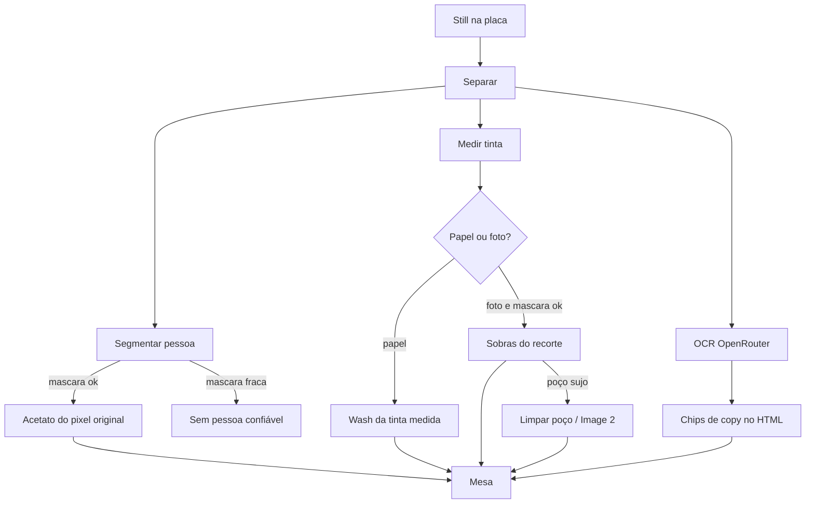

# Camadas (mesa híbrida)

Mesa da Modelagem que **separa um still em acetatos**: pessoa (se o recorte for fiel), tinta do campo, e tipo no HTML. Não é o Trocr (não redesenha a peça). Não é a Mesa de Conceito 15s (não fecha roteiro nem HTML de canal).

A tela vive em `/parametros/modelagem-criativos/camadas`. Título no desk: **Camadas do still**. Lead: *Pessoa só se o recorte for fiel. Papel vira wash. Headline e CTA ficam no HTML.*

Contrato: **híbrido**. Segmentação semântica para a pessoa. Wash da tinta medida no papel. Image 2 só limpa o poço vazio de uma foto. Tipo nunca vira PNG de glifo.

Autenticação: `admin_required` na página, `admin_required_api` nas rotas JSON.

Documento irmão do Trocr: [`docs/trocar.md`](trocar.md). UX do chrome: [`docs/modeling-ux-refactor.md`](modeling-ux-refactor.md). Lab silencioso (Fase 1+): [`docs/camadas-lab/state.md`](camadas-lab/state.md).

---

## 1. O que a funcionalidade faz

1. O usuário solta um still (PNG, JPG ou WEBP) na placa 16:9, ou abre o criativo de teste.
2. Clica **Separar**.
3. O servidor recorta no Python (`split_still`) e, se houver OpenRouter, lê a copy com o mesmo OCR do Trocr (`read_attached_still` → `read_swap_reference` em modo `strict`).
4. A mesa pinta:
   - acetato **Pessoa** (pixel original) **ou** o aviso *Sem pessoa confiável*;
   - acetato **Tinta** (wash sólido no papel; leftover só em foto com máscara ok);
   - chips **Tipo no HTML** (headline, apoio, preço, CTA, logo).
5. Se o still for classificado como **foto** (`ground_kind == image`), aparece **Limpar poço**. Image 2 gera só o fundo vazio. Nunca o elenco.
6. Cada acetato tem *Baixar PNG*.

O que **não** faz:

- Não pede à Image 2 a pessoa. Isso redesenha o rosto.
- Não devolve o JPG menos um buraco como “fundo” quando o still é papel (no TIM o leftover **é** o anúncio).
- Não extrai glifo de headline. Tipo continua HTML.
- Não persiste histórico de versões (isso é do Trocr).

---

## 2. Fluxo (contrato híbrido)



Dois motores, um CTA principal:

| Ação na mesa | `engine` no POST | O que roda |
|---|---|---|
| **Separar** | `python` (default) | `split_still` + OCR |
| **Limpar poço** | `image` / `image2` / `decompose` | Image 2 só se `ground_kind == image` |
| **Abrir criativo de teste** | GET example + Separar | still sintético 16:9 (tinta, tipo, selo, pessoa) |

Image 2 **não** preenche falha de pessoa. Se o gate recusou o acetato, a mesa admite o limite.

---

## 3. Tecnologias

| Camada | Tecnologia | Onde |
|---|---|---|
| Página | Flask + Jinja, desk `camadas` | `MC_DESKS["camadas"]` em `creative_modeling_routes.py` |
| CSS | `modelagem_criativos.css` (bloco `.mc-layers`) | `?v=96` no desk |
| Cliente | `mc-camadas.js` (IIFE, sem framework) | `static/js/mc-camadas.js?v=46` |
| Recorte | Pillow (PIL) | `split_layers.py` |
| Pessoa (1) | `rembg` + `u2net_human_seg` | opcional; lê forma, não cor |
| Pessoa (2) | Ultralytics YOLO-seg `person` (`yolov8n-seg.pt`) | opcional |
| Pessoa (3) | `field_predictor` | pele / o que não é tinta; último recurso |
| Tinta | mediana das amostras de canto + union invertida | `_corner_field`, `_field_rgb` |
| OCR | OpenRouter chat visão `openai/gpt-5-nano` | `read_swap_reference` + `READ_STRICT_SYSTEM` |
| Poço | OpenRouter Images `openai/gpt-image-2` | `generate_image` + `GROUND_PROMPT` |
| Auth LLM | `resolve_api_key()` (integração ou `OPENROUTER_API_KEY`) | `openrouter_service` |

`rembg` + `onnxruntime` e `ultralytics` **não** são obrigatórios no deploy. Sem eles a mesa continua: tinta e OCR funcionam; pessoa só sai se um predictor for injetado ou se o field passar no gate.

Variáveis de ambiente:

| Variável | Default | Uso |
|---|---|---|
| `OPENROUTER_API_KEY` | — | OCR e Image 2 se a integração não resolver |
| `CREATIVE_FORMAT_SWAP_READ_MODEL` | `openai/gpt-5-nano` | OCR |
| `CREATIVE_FORMAT_SWAP_READ_TEMPERATURE` | `0` | OCR |
| `CREATIVE_FORMAT_SWAP_READ_MAX_TOKENS` | `1200` | OCR |
| `AGENT_OPENROUTER_MODEL` | `openai/gpt-4o-mini` | fallback do chat |
| `CREATIVE_IMAGE_MODEL` | `openai/gpt-image-2` | Limpar poço |

---

## 4. Mapa de arquivos

```
aicentralv2/creative_format_lab/split_layers.py     recorte, escada, gate, wash / leftover
aicentralv2/creative_format_lab/decompose.py        Image 2: só GROUND_PROMPT
aicentralv2/creative_format_lab/engineer.py         read_attached_still (OCR slim)
aicentralv2/creative_format_lab/swap.py             READ_SYSTEM / READ_STRICT_SYSTEM
aicentralv2/creative_format_lab/service.py          FormatLabService.split_layers / _decompose_layers
aicentralv2/creative_modeling_service.py            split_format_lab_layers / example_format_lab_layers
aicentralv2/creative_modeling_routes.py             HTTP + MC_DESKS.camadas
aicentralv2/services/openrouter_service.py          chat_completion + generate_image
aicentralv2/templates/parametros/_mc_camadas.html   placa, acetatos, chips
aicentralv2/templates/parametros/_mc_shell.html     nav Camadas
aicentralv2/templates/parametros/modelagem_desk.html cache CSS v=96 / JS v=46
aicentralv2/static/js/mc-camadas.js                 um Separar; Limpar poço se foto
aicentralv2/static/css/modelagem_criativos.css      .mc-layers*
tests/test_creative_format_lab.py                   split TIM-like, OCR, Image 2
tests/test_modelagem_criativos.py                   desk e rotas
```

---

## 5. Fluxo do usuário na mesa

### 5.1 Carregar o still

Aceita `image/png`, `image/jpeg`, `image/webp`. FileReader vira `data:image/...;base64,...` e fica em memória no cliente (`imageUrl`). Não há upload multipart: o POST manda o data URL no JSON.

**Abrir criativo de teste** chama `GET /parametros/api/format-lab/layers/example` e em seguida Separar. O example é `hypothetical_still()`: 480×180, campo `#0033FF`, tipo branco, selo amarelo, elipse de pele.

### 5.2 Separar

1. `setBusy(true)` — botões desabilitados; status *Recortando no Python.*
2. `POST` com `{ image, engine: "python" }`.
3. `showPack(data)`:
   - `lastKind = data.ground_kind`
   - grid de acetatos + aviso se `!cast_ok`
   - overlay de caixas só em `role === cast`
   - badge da tinta (`--layers-field`)
   - chips de `data.read`
   - engine: `python · recorte` se `cast_ok`, senão `python · tinta` (ou o nome do segmentador: `rembg` / `yolo` / `custom`)
4. Passo da tally vai para **Tinta** (3).
5. **Limpar poço** só sai de `hidden` se `lastKind === "image"`.

### 5.3 Limpar poço

Só faz sentido depois de um Separar em foto. `POST` com `{ image, engine: "image" }`. Status *Limpando o poço da foto.* Resposta: uma camada `ground`, `engine: "image2"`, `cast_ok: false`. Pessoa **não** volta.

Se o still for papel, o servidor responde 400: *Este still é papel. A tinta já é o wash. Image 2 só limpa poço de foto.*

---

## 6. Payloads HTTP

Prefixo das rotas: `/parametros` (blueprint). Envelope padrão: `{ "success": true, "data": ... }` ou `{ "success": false, "error": "..." }`.

### 6.1 `GET /parametros/api/format-lab/layers/example`

Resposta `data`:

```json
{
  "image": "data:image/png;base64,...",
  "width": 480,
  "height": 180,
  "engine": "python",
  "ground_kind": "paper"
}
```

### 6.2 `POST /parametros/api/format-lab/layers/split`

Pedido (mesa):

```json
{
  "image": "data:image/png;base64,...",
  "engine": "python"
}
```

Campos aceitos no servidor (além do que a mesa manda):

| Campo | Quem usa | Notas |
|---|---|---|
| `image` / `reference` | split e decompose | data URL ou URL http(s) |
| `engine` | `python` (default) ou `image` / `image2` / `decompose` | |
| `predictor` | testes / injeção | callable; a mesa **não** envia |
| `text_callable` | testes | senão `modeling.generator.text_callable` → `chat_completion` |
| `image_callable` | testes | senão `generator.generate_image` |
| `generate` | `_image_callable` | `false` desliga Image 2 |

Resposta `data` do Separar (Python):

```json
{
  "layers": [
    {
      "id": "cast-0",
      "role": "cast",
      "label": "Pessoa",
      "box": { "x": 67.2, "y": 8.3, "w": 12.8, "h": 83.3 },
      "png_data_url": "data:image/png;base64,..."
    },
    {
      "id": "ground-1",
      "role": "ground",
      "label": "Fundo",
      "box": { "x": 0, "y": 0, "w": 100, "h": 100 },
      "png_data_url": "data:image/png;base64,..."
    }
  ],
  "field": "#011A54",
  "engine": "python",
  "cast_ok": false,
  "ground_kind": "paper",
  "width": 1600,
  "height": 900,
  "read": {
    "headline": "Acesse vantagens exclusivas e um super bônus de internet",
    "support": "",
    "price": "R$ 169,99",
    "cta": "Conferir planos",
    "logo_text": "TIM BLACK"
  }
}
```

`read` só entra se o OCR devolveu pelo menos um campo. Sem `text_callable` / chave, o split **não falha**: devolve camadas sem `read`. A mesa esconde o bloco Tipo.

`box` está em **porcentagem** do still (`x, y, w, h`).

Roles possíveis nas camadas:

| `role` | Origem | Na mesa |
|---|---|---|
| `cast` | label `person` + gate ok | Pessoa |
| `product` | detecção YOLO não-pessoa | Produto (raro no fluxo default) |
| `ground` | sempre | Tinta |

Resposta do Limpar poço (sucesso):

```json
{
  "layers": [
    {
      "id": "ground-0",
      "role": "ground",
      "label": "Fundo",
      "box": { "x": 0, "y": 0, "w": 100, "h": 100 },
      "png_data_url": "data:image/png;base64,..."
    }
  ],
  "field": "#B16CB4",
  "engine": "image2",
  "cast_ok": false,
  "ground_kind": "image",
  "width": 640,
  "height": 640
}
```

`cast_url` do `decompose_creative` é sempre `""`. Uma chamada Image 2.

Erros (`CreativeConflictError` → 400):

| Mensagem | Quando |
|---|---|
| `Envie um still.` | Image 2 sem imagem |
| `Este still é papel. A tinta já é o wash. Image 2 só limpa poço de foto.` | `ground_kind != image` |
| `Image 2 não está disponível.` | sem `generate_image` |
| credencial / saldo / rate limit OpenRouter | OCR ou Image 2 |

---

## 7. Prompts

### 7.1 OCR (Separar)

O lab chama `read_swap_reference({ image, strict: true })`. Modelo, temperatura e teto vêm das env do Trocr.

Mensagens:

```
system: READ_STRICT_SYSTEM
user:
  text: "Leia os elementos editáveis deste still."
  image_url: <data URL ou URL do still>
```

`READ_SYSTEM` (base):

```
Você lê um still de anúncio. Extraia só o que está visível.
Não invente oferta, preço, nome ou slogan. Copy em português do Brasil exatamente como aparece, com acento.
Cartela de evento: cada selo de nome é um element role=person. Datas vão em dates. Local vai em venue.
O grito da peça (É de graça, Entrada franca, etc.) vai em support ou cta — nunca some.
Bandeirola, fitas ou padrão repetido = graphic true.
style descreve o que se vê (cor do campo, luz, recorte). Nunca repita estas instruções.
Se um texto estiver ilegível, deixe vazio. Não corrija português. Retorne JSON puro:
{
  "headline": "",
  "support": "",
  "subtitle": "",
  "price": "",
  "cta": "",
  "disclaimer": "",
  "logo_text": "",
  "dates": "",
  "venue": "",
  "aspect_hint": "1:1",
  "style": "fundo azul, pessoa à direita, tipo à esquerda",
  "elements": [
    {"role": "person", "text": "nome no selo", "note": "onde está"}
  ],
  "analysis": {
    "background": true,
    "images": true,
    "graphic": false,
    "logo": true,
    "headline": true,
    "secondary": true,
    "cta": true,
    "supports": false
  }
}
roles válidos: logo, headline, support, cta, product, price, person, background, graphic.
analysis marca o que está visível. aspect_hint é 16:9, 9:16, 4:5 ou 1:1. Print de celular não muda o aspect da peça.
```

`READ_STRICT_SYSTEM` acrescenta:

```
VALIDAÇÃO: transcreva glifo a glifo. Se o still escreveu Mumuzinho ou franceça, copie o erro.
Não normalize para o nome famoso nem corrija acento.
```

A mesa **não** pinta o JSON inteiro. `read_attached_still` slima para:

```
headline, support, price, cta, logo_text
```

`dates`, `venue`, `elements` (selos de artista) ficam no Trocr, não nos chips de Camadas. Foi o que aconteceu no Arraial: headline + *É de graça!* + Belotur; datas e Mineirinho não apareceram.

### 7.2 Image 2 — poço (`GROUND_PROMPT`)

Único prompt disparado em `decompose_creative`:

```
Recreate only the background of this advertisement as an empty photographic well.
No people, no faces, no typography, no logos, no prices, no buttons.
Clean empty field ready for HTML type. Same colors as the source.
```

Chamada: `generate_image(GROUND_PROMPT, aspect_ratio, background="opaque", input_references=[still])`.

Aspecto derivado do probe Python:

| Razão `width/height` | `aspect_ratio` |
|---|---|
| ≥ 1,45 | `16:9` |
| ≤ 0,75 | `9:16` |
| senão | `1:1` |

### 7.3 Image 2 — elenco (`CAST_PROMPT`) — morto

O texto ainda existe em `decompose.py` e **não é chamado**:

```
Extract only the people from this advertisement as one group cutout.
Keep every face, body, pose, hair and garment exactly.
Remove the background, typography, logos, prices, buttons and decorations.
Clean figure only. No new people. No text.
```

Histórico: no TIM Black a Image 2 redesenhou o rosto. O contrato novo proíbe essa rota.

---

## 8. Motor Python — profundidade

Arquivo: `split_layers.py`. Entrada: data URL / URL / PIL. Saída: layers + `field` + `engine` + `cast_ok` + `ground_kind`.

### 8.1 Escada de pessoa (`resolve_predictor`)

1. **`rembg`** (`u2net_human_seg`) — forma humana. `engine = "rembg"`.
2. **YOLO-seg** filtrado em `person` — `engine = "yolo"`.
3. **`field_predictor`** — `engine = "python"`.

`split_still(predictor=fn)` usa o callable injetado e marca `engine = "custom"` (testes).

`field_predictor` não é segmentador semântico:

1. Corta margem branca de print (`_trim_paper`).
2. Mede a tinta nos cantos (`_corner_field`).
3. Tenta pele (`_skin_mask` + `_pick_person`).
4. Senão, “o que não é a tinta” menos tipo claro à esquerda (`_without_type`).
5. Preenche a partir da pele (`_fill_from_skin`).

Blusa da mesma tinta do campo (TIM navy) vira campo. Por isso o default deixou de ser o field.

### 8.2 Gate de qualidade (`_mask_quality`)

Depois da máscara, o acetato de pessoa é **recusado** se:

| `reason` | Regra |
|---|---|
| `empty` | `getbbox()` vazio |
| `tiny` | cobertura &lt; 2% do quadro |
| `full-frame` | caixa &gt; 92% da largura **e** &gt; 88% da altura |
| `paper` | &gt; 55% dos pixels da máscara são papel branco de print |
| `field-garment` | só em engine ≠ `rembg`/`yolo`: &gt; 45% da máscara está a distância &lt; 80 da tinta **e** pele &lt; 18% |

`field-garment` captura a blusa TIM ≈ `#011xxx`. Em rembg/yolo a blusa navy semântica **é** válida.

Log: `Máscara de pessoa recusada: {reason}`. A mesa só vê `cast_ok: false`.

### 8.3 Papel vs foto (`classify_ground`)

Amostra o quadro (passo `min(lado)//80`). Se ≥ 28% dos pontos estão a distância &lt; 48 da tinta medida → **`paper`**. Senão → **`image`**.

| `ground_kind` | `cast_ok` | PNG do fundo |
|---|---|---|
| `paper` | qualquer | wash RGB sólido (`Image.new` da tinta) |
| `image` | `false` | wash (não cola leftover sujo) |
| `image` | `true` | leftover: still menos a máscara da pessoa |

`field` é hex `#RRGGBB` da mediana do que **não** é a union da pessoa (`_field_rgb`). No TIM real mediu `#011A54`. No Arraial, `#B16CB4`.

### 8.4 Fixtures de laboratório

| Função | Uso |
|---|---|
| `hypothetical_still()` | example da mesa + testes de recorte básico |
| `tim_like_still()` | campo navy, retângulo navy (blusa), pele, tipo branco |
| `lifestyle_still()` | ruído fotográfico + elipse de pele — Image 2 pode disparar |

---

## 9. Profundidade da mesa (UI)

Tally: Still → Pessoa → Tinta. Copy não é passo: é painel à direita.

| Elemento | ID | Papel |
|---|---|---|
| Drop / file | `mcLayersDrop` / `mcLayersFile` | still |
| Preview + caixas | `mcLayersPreview` / `mcLayersOverlay` | placa |
| Separar | `mcLayersRun` | CTA único |
| Limpar poço | `mcLayersImage` | secundário, `hidden` até foto |
| Demo | `mcLayersDemo` | example + split |
| Badge tinta | `mcLayersField` | hex + swatch `--layers-field` |
| Status | `mcLayersStatus` / `mcLayersHint` | copy viva |
| Aviso pessoa | `mcLayersCastNote` | `is-ok` se recorte |
| Acetatos | `mcLayersGrid` | Pessoa / Tinta / vazio |
| Chips | `mcLayersCopy` / `mcLayersCopyList` | Tipo no HTML |
| Engine | `mcLayersEngine` | `Python · recorte` / `· tinta` / `Image 2 · poço` |

Labels dos chips (`COPY_LABEL`): Headline, Apoio, Preço, CTA, Logo. Vazio some. Sem preço (Arraial) o chip Preço não existe.

---

## 10. Casos verificados

### 10.1 TIM Black (papel)

Still de anúncio TIM: modelo, campo navy, 110 GB, R$ 169,99, *Conferir planos*.

| Esperado | Resultado |
|---|---|
| `cast_ok` | `false` sem rembg/yolo (blusa = tinta) |
| `ground_kind` | `paper` |
| `field` | `#011A54` |
| camadas | só `ground` wash navy |
| Limpar poço | **oculto** |
| Image 2 | 400 se forçado |

Com predictor mockado de pessoa: acetato no pixel, ground **ainda** wash (papel).

### 10.2 Arraial 2026 (cartela 1:1 + OpenRouter)

Banner Spotify 640×640: elenco, *Te encontro no ARRAIAL De Belô 2026*, datas, Mineirinho, *É de graça!*, Belotur / PBH.

| Esperado | Resultado na mesa (OpenRouter ligado) |
|---|---|
| OCR | Headline *Te encontro no ARRAIAL De Belo 2026*; Apoio *É de graça!*; Logo *Belotur* |
| Datas / local / selos | lidos no JSON do Trocr; **não** pintados nos chips |
| Pessoa | recusada neste Python (sem rembg/YOLO; field + gate) |
| `field` | `#B16CB4` |
| `ground_kind` | `image` (variação de foto + tipo + bandeirola ≥ limiar de papel) |
| Limpar poço | **visível** — não clicado no teste (fundo já é wash) |

### 10.3 Lifestyle sintético

`lifestyle_still()`: `ground_kind == image`. Image 2 permitido; uma chamada; só camada `ground`; `cast_ok` false no decompose.

---

## 11. Limites e armadilhas

1. **Sem segmentador**, cartela com muita gente + tipo (Arraial) cai no field e o gate recusa — a mesa fala a verdade em vez de um recorte mentiroso.
2. **Gate `field-garment` não vale para rembg/yolo.** Blusa navy semântica é acetato válido; o fundo de papel continua wash.
3. **`ground_kind == image` + `cast_ok == false`** ainda gera wash, mas **mostra** Limpar poço. Image 2 pode limpar um poço que o Python já achatou.
4. **OCR sem chave** não quebra o Separar; só some o bloco Tipo.
5. **`read` slim** descarta `dates`, `venue`, `elements`. Evento de cidade perde metade da copy na mesa.
6. **Data URL no POST** pesa (still 4K). Não há persistência do PNG no servidor nesta mesa.
7. **`CAST_PROMPT`** é lastro. Não reativar.
8. Deploy sem `torch` / `onnxruntime` é intencional. Documente o limite na UI, não instale GPU por default.

---

## 12. Testes

Em `tests/test_creative_format_lab.py`:

| Teste | Contrato |
|---|---|
| `test_split_tim_like_sem_segmentador_vira_wash` | `cast_ok` false, wash `#01…`, sem camada cast |
| `test_split_tim_like_com_predictor_mantem_wash` | cast ok + ground ainda paper |
| `test_split_sempre_devolve_ocr_no_html` | `read.price` / `read.cta` com `text_callable` mock |
| `test_split_engine_image2_empacota_decompose` | papel → erro; lifestyle → 1 call, só ground |
| `test_split_still_nao_engole_tipo_nem_letra_3d` | tipo branco não vira pessoa |

Rotas e desk: `tests/test_modelagem_criativos.py` (JS aponta para `/api/format-lab/layers/split` e `example`; HTML tem *Limpar poço*; cache `mc_page_js?v=46`).

Para exercitar OCR de verdade: `OPENROUTER_API_KEY` no processo + `generator.text_callable = chat_completion`. Não grave a chave no repositório.

---

## 13. Relação com o resto da Modelagem

| Mesa | Papel |
|---|---|
| **Camadas** | acetatos + copy HTML a partir de um still |
| **Trocr** | lê o mesmo OCR, mas **reedita** a peça (typeset / recrop / Image 2) |
| **Placas** | retângulos da marca no canal |
| **Conceito** | 15s, knobs, `apply_still_read` reusa este OCR no lab |
| **Extrair** | agente; `decompose=true` ainda importa `decompose_creative` (hoje só poço) |

O tipo que a Camadas mostra é o mesmo contrato do Trocr: o still escreveu, o HTML carrega, o PNG não inventa letra.
