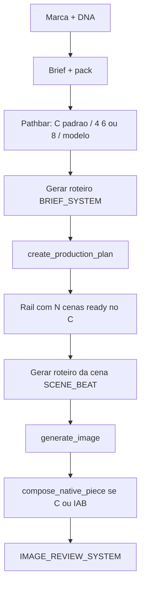
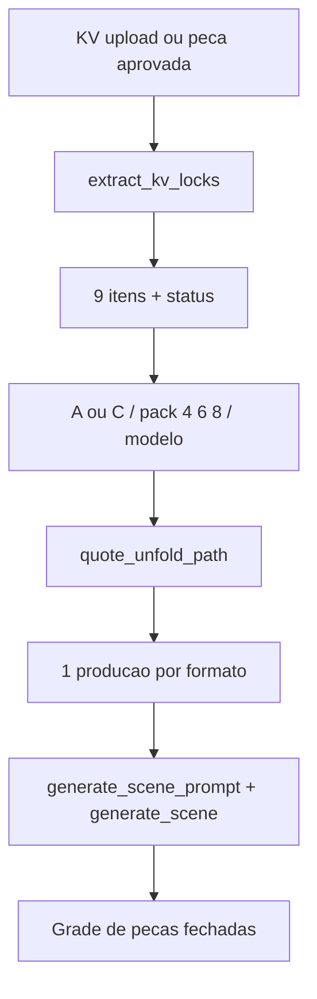

# Modelagem de Criativos — estado completo

Documento de referência do que existe hoje na aba **Modelagem de Criativos** (`/parametros/modelagem-criativos`). Cobre fluxos, prompts, modelos, temperaturas, custos, outputs previstos e o que foi entregue nesta fatia (Desdobrador caminho C + Preparar com 4/6/8 cenas).

Data de corte: 10 de setembro de 2026.

---

## 1. Job to be done

Há dois jobs distintos. O código ainda mistura os dois no mesmo gerador de imagem.

| Job | Aba | O que a pessoa quer | Output esperado |
| --- | --- | --- | --- |
| **Propor** um anúncio novo a partir de brief + pack + DNA | Preparar → Produzir | Várias batidas do *mesmo* anúncio no retângulo do formato | 4, 6 ou 8 stills + copy da marca no compositor |
| **Reproduzir** um KV aprovado nos retângulos de mídia | Desdobrar | A mesma peça-mãe, adaptada de geometria, sem inventar marca/copy | Uma peça fechada por formato, editável, com texto literal |

O compromisso declarado é excelência, não custo. Na prática o gerador ainda pede à IA que *pinte* tipografia. Resultado típico (Half Page 300×600, ~R$ 0,91, selo “Montada / Publicável”): texto ilegível (`MEGEADE`, `CONTRATARRER`), marca aproximada, estilo do KV não transferido.

---

## 2. Superfície do produto

Arquivos da UI:

- Página: [`aicentralv2/templates/parametros/modelagem_criativos.html`](../aicentralv2/templates/parametros/modelagem_criativos.html)
- Painéis: `_mc_gerador.html` (Preparar), `_mc_variacoes.html` (Produzir), `_mc_desdobrar.html` (Desdobrar), `_mc_biblioteca.html`, `_mc_clientes.html`, `_mc_historico.html`
- JS: [`aicentralv2/static/js/modelagem_criativos.js`](../aicentralv2/static/js/modelagem_criativos.js) (`?v=39`)
- CSS: [`aicentralv2/static/css/modelagem_criativos.css`](../aicentralv2/static/css/modelagem_criativos.css)

Abas: Preparar, Produzir, Desdobrar, Formatos, Marcas, Histórico.

---

## 3. Stack e provedores

| Camada | Tecnologia | Onde |
| --- | --- | --- |
| App | Flask + Jinja + JS vanilla | `creative_modeling_routes.py` |
| Persistência | PostgreSQL (`cx_campaigns`, `cx_creative_productions`, `cx_creative_scenes`, `cx_generated_assets`, `cx_generation_jobs`) | `creative_modeling_repository.py` |
| Texto / visão | OpenRouter `chat_completion` | `services/openrouter_service.py` |
| Imagem | OpenRouter `POST https://openrouter.ai/api/v1/images` | `creative_modeling_generation.py` |
| Scraping de marca | Firecrawl (site da marca) | `creative_brand_analysis.py` + `crm_v3_web_scout.py` |
| Compositor | PNG em Python, fonte bitmap 5×7, sem TTF | `creative_format_compose.py` |
| FX | USD→BRL (`USD_BRL_RATE` ou 5,5) | `creative_modeling_fx.py` |
| Vídeo (fora do fluxo diário) | Higgsfield payload, 4 stills → roteiro | `build_higgsfield_payload` |

Timeout da imagem: 180 s. Máximo **2** `input_references` por chamada (KV + 1 extra: pack, logo ou cena anterior).

---

## 4. Modelos

### 4.1 Texto (sempre o mesmo, salvo override de env)

| Constante | Env | Default |
| --- | --- | --- |
| `DEFAULT_TEXT_MODEL` | `CREATIVE_TEXT_MODEL` | `openai/gpt-5.4` |
| Análise factual de marca | `CREATIVE_BRAND_ANALYSIS_MODEL` | `perplexity/sonar-pro` |
| Refino visual + linha criativa | `CREATIVE_BRAND_VISUAL_MODEL` | `openai/gpt-5.4` |

O user de texto é quase sempre `json.dumps(context)`. O system muda por job.

### 4.2 Imagem (escolhíveis no pathbar)

Definidos em [`creative_construct_params.py`](../aicentralv2/creative_construct_params.py) → `IMAGE_MODELS`.

| ID OpenRouter | Rótulo na UI | Papel previsto | Draft (low/1K) | Publish (high/2K) | Nota no código |
| --- | --- | --- | --- | --- | --- |
| `openai/gpt-image-2` | GPT Image 2 | Padrão do A; melhor até agora na prática | US$ 0,006 | US$ 0,22 (~R$ 1,21 a 5,5) | Sem PNG transparente |
| `black-forest-labs/flux.2-pro` | FLUX.2 Pro | Padrão automático do C | US$ 0,08 | US$ 0,11 | Recorte do talent |
| `google/gemini-2.5-flash-image` | Gemini Flash Image | “Nano banana” | US$ 0,06 | US$ 0,12 | Alpha / fundo transparente |

Default global se ninguém escolher: `CREATIVE_IMAGE_MODEL` ou `openai/gpt-image-2`.

Julgamento de produção (10/09): **FLUX não funciona** para este job; **Gemini Flash é ruim**; **GPT Image 2 é o menos pior** e ainda assim pinta tipografia errada a ~R$ 0,90–1,20 no publish.

### 4.3 Fidelidade raster (não é montagem)

[`creative_image_fidelity.py`](../aicentralv2/creative_image_fidelity.py)

| Tier | quality | resolution | Quando |
| --- | --- | --- | --- |
| `draft` | `low` | `1K` | Caminho A (pintar) se ninguém pedir alta |
| `publish` | `high` | `2K` | Caminho C por padrão; botão Publicável |

A montagem (LOCK, geometria, compositor) **não muda** com o tier. O publish só acrescenta `PUBLISH_UPGRADE_RULES`: “reproduza o rascunho aprovado em resolução maior, sem restyle”.

---

## 5. Temperaturas de texto

`TEXT_TEMPERATURES` em `creative_modeling_generation.py`. Cada chave aceita override `CREATIVE_TEMP_<NOME>`.

| Job | Chave | °C | System prompt | max_tokens | JSON de saída previsto |
| --- | --- | --- | --- | --- | --- |
| Direção de cena (Preparar/Produzir) | `prompt` | 0,25 | `SCENE_BEAT_SYSTEM` | 1800 | `{prompt_en, rationale_pt, checks[]}` |
| Direção de desdobramento | `unfold_prompt` | 0,20 | `UNFOLD_PROMPT_SYSTEM` | 1800 | idem |
| Brief / roteiro de cenas | `brief` | 0,35 | `BRIEF_SYSTEM` | 2200 | `{campaign_text, cta_text, visual_bible, scenes[]}` |
| Extrair itens do KV | `extract_kv_locks` | 0,05 | `UNFOLD_LOCK_SYSTEM` | 800 | headline, subhead, cta, items[9] |
| A/B simples (só cor) | `ab_simple_prompt` | 0,30 | `UNFOLD_AB_SIMPLE` | 1200 | prompt de recolor |
| A/B máximo (recorte) | `ab_max_prompt` | 0,45 | `UNFOLD_AB_MAX` | 1200 | prompt de recrop/restyle |
| Revisão de imagem | `review` | 0,10 | `IMAGE_REVIEW_SYSTEM` | 900 | score, defects, locks |
| Revisão com travas | `review_locks` | 0,10 | idem | 900 | + `text_locked`, `cta_locked`, `logo_locked` |
| Roteiro de vídeo (4 stills) | `script` | 0,30 | `SCRIPT_SYSTEM` | 1800 | 4 shots + endcard |
| Análise de marca (site) | — | 0,15 | `BRAND_ANALYSIS_SYSTEM` | 2200 | perfil + paleta |
| Refino visual da marca | — | 0,05 | `BRAND_VISUAL_REFINEMENT_SYSTEM` | 1800 | cores observadas |
| Linha criativa | — | 0,05 | `CREATIVE_LINE_SYSTEM` | — | `gpt_image_instruction`, `copy_system` |

Imagem **não tem temperatura**. Parâmetros: `prompt`, `aspect_ratio` (normalizado para o conjunto 1:1, 3:2, 2:3, 4:3, 3:4, 16:9, 9:16, 21:9), `quality`, `resolution`, `background=opaque`, até 2 referências.

---

## 6. Dois motores: A pintar vs C montar

[`resolve_construct_path`](../aicentralv2/creative_construct_params.py)

| | A · `paint` | C · `construct` |
| --- | --- | --- |
| Default no Desdobrar | sim (radio “Pintar a peça”) | não |
| Default no Preparar | não | sim (`engine=construct`, `fidelity=publish`) |
| Modelo se vazio | GPT Image 2 | FLUX.2 Pro |
| Fidelidade se vazia | draft | publish |
| `paints_full_copy` | social unfold: **sim** (pede anúncio completo) | **sempre false** |
| `should_compose` | só IAB nativo (half, wide, rectangle, slate) | **sempre**, inclusive social |
| Cenas 2–N | nascem `blocked` até aprovar a anterior | nascem `ready`; geração em paralelo |
| Cotação | 1 chamada por peça | 1 chamada por cena única do pack (Desdobrar) ou por batida (Preparar) |

Intenção do C: a IA adapta só o talent/fotografia; headline, CTA, logo e legal entram no compositor com o texto *visto*.

O que acontece de fato no C IAB (o Half Page da captura):

1. O prompt ganha `NATIVE ADVERTISING STILL` + “copy composed later”.
2. GPT/FLUX ainda pinta letras no still (não obedece).
3. `compose_native_piece` recorta esse still (já com lixo tipográfico) para a zona `visual` e desenha headline/CTA **por cima** com fonte bitmap 5×7.
4. A peça sai “Montada” e “Publicável”. O usuário vê duas camadas de texto ruim: a pintada e a bitmap.

Social no A: `COMPLETE SOCIAL ADVERTISEMENT` — a IA é *instruída* a pintar headline, CTA e logo. É o pior contrato possível para tipografia.

---

## 7. Itens do KV (contrato de leitura)

Nove itens, status `seen` | `uncertain` | `absent`:

`logo`, `product_lockup`, `talent`, `headline`, `offer`, `benefits`, `cta`, `legal`, `background`.

Regras:

- Texto vazio + CTA → `absent`. O compositor **não** inventa “SAIBA MAIS”.
- `normalize_kv_items` / `locks_from_kv_items` / `normalize_locks` unificam o payload antigo (headline/cta soltos) com o dicionário `items`.
- Extração (`extract_kv_locks`): visão no KV + notas; temperatura 0,05; notas vencem a imagem.

UI do Desdobrar: cada item tem select Visto / Conferir / Fora + campo de texto. Isso é o contrato humano. O gerador ainda trata essas strings como *hints de prompt*, não como camadas obrigatórias.

---

## 8. Fluxo Preparar → Produzir

### 8.1 Preparar

1. Cliente (logo, cores, `brand_profile`, `creative_line`).
2. Nome, objetivo, mensagem, pack (até 4 criativos + URL), CTA, preço sim/não.
3. Formato de saída (inventário IAB / social / streaming).
4. Pathbar novo:
   - Como fecha: **Montar em camadas** (padrão) / Pintar a peça
   - Recortes: **4 / 6 / 8** (estático começa em 4)
   - Motor da foto + cotação `POST /parametros/api/unfoldings/quote` com `scene_count`
5. “Gerar roteiro” → `enhance_campaign_brief` aceita `scene_count` ∈ {1, 4, 6, 8}.
6. “Iniciar produção” grava `construct_path` + `locks` do pack no `creative_brief`.

`scene_count_for_format` virou **sugestão**: 1 no estático/social, 4 no interativo. O lote manda.

### 8.2 Beats do mesmo anúncio (não variações)

| N | Papéis |
| --- | --- |
| 1 | `composicao_final` |
| 4 | gancho, contexto, benefício, fechamento |
| 6 | + oferta/prova + reforço |
| 8 | + segundo gancho + segundo fechamento (A/B de talent) |

`format_direction(..., scene_count=N)` usa o N do lote. CTA só na última batida e só se o formato tiver CTA.

### 8.3 Produzir

Por cena:

1. `generate_scene_prompt` — LLM escreve `prompt_en`; o serviço concatena `VISIBLE COPY REQUIREMENT` (pt-BR), `BRIEF_LOCK_RULES`, `ANTI_AI_LOOK`, e o sufixo nativo/social.
2. Pessoa revisa e aprova (`prompt_status=approved`).
3. `generate_scene` — raster + referências (pack na cena 1, `previous_approved_asset_url` se couber, logo da marca).
4. Compositor se `should_compose`.
5. Review multimodal.
6. Aprovar peça / gerar outra / refinamentos (`chrome`, `geometry`, `ai_look`, `logo`, `remove_cta`, `brand`).

No C as cenas já nascem `ready`. Continuidade é referência visual, não bloqueio de fila.

### 8.4 Output previsto do Preparar

- Rail com 4, 6 ou 8 stops no retângulo real do formato.
- Cada stop: still fotográfico do talent + overlay de copy vista.
- Custo previsto = `unit(modelo, fidelity) × N` no C.

---

## 9. Fluxo Desdobrar

### 9.1 Passos

1. Marca + soltar KV (ou pegar peça já gerada).
2. Leitura dos 9 itens; pessoa corrige texto e status.
3. Pathbar: pintar vs montar, 4/6/8 recortes de foto, motor, cotação ao vivo.
4. Retângulos (Feed, Story, LinkedIn, Half Page, Medium Rectangle, Leaderboard, Mobile…).
5. “Fechar as peças”.
6. Contato: peça por formato; “Outra cor” (A/B simples) / “Outro recorte” (A/B máximo); Publicáveis em lote.

### 9.2 Agrupamento de cenas no C (economia)

O pack **na cotação** não é “N formatos = N fotos”. Formatos do mesmo recorte compartilham still *no preço*:

- 4: square, story, landscape, half_page
- 6: + rectangle + wide
- 8: + mobile + square_ab

Ex.: Instagram Feed e Facebook Feed *deveriam* compartilhar a foto `square`. Mobile no pack 6 reusa `wide` na conta.

`generate_unfolding` **não reusa o raster**: chama `generate_scene` por produção. `shared_pieces` existe só em `quote_unfold_path`. O lote C cobra como se compartilhasse e gera como se não compartilhasse.

### 9.3 Referências enviadas à imagem

Ordem em `generate_scene` (teto 2):

1. Upgrade publish: rascunho aprovado.
2. Unfold: KV (`source.kv_asset_url`).
3. Cena 1 do model: imagens do campaign pack.
4. `previous_approved_asset_url` se ainda couber.
5. Assets de marca (`_append_brand_references`).

Não existe Model-T (contrato visual por formato) nesta fatia. A IA não recebe um “é isto que espero” — só o KV cru + um prompt longo. A API de imagem não rotula as refs (“esta é o KV”, “esta é o logo”); só manda URLs. A frase “The first attached image is the KV” existe só no sufixo **social A**. No IAB, o KEEP do KV depende do LLM ter escrito isso no `prompt_en`.

### 9.4 Output previsto do Desdobrar

- Uma peça por retângulo marcado, no tamanho IAB/social real.
- Copy = strings `seen`/`uncertain`; item `absent` some.
- Selo **Montada** = `metadata.engine === 'construct'`. Não prova que o compositor rodou (se o compose falha, o asset é o raster cru e o selo continua Montada).
- Selo **Publicável** = `metadata.fidelity === 'publish'` (high/2K). É tier de custo, não QA de copy.
- Ajuste de texto no clique **não** deve gerar foto de novo (copy da UI). O raster por baixo continua o que a IA pintou.

---

## 10. Biblioteca de prompts (o que cada um manda fazer)

Todos em [`creative_modeling_prompts.py`](../aicentralv2/creative_modeling_prompts.py) e systems em [`creative_modeling_generation.py`](../aicentralv2/creative_modeling_generation.py).

### 10.1 Travas determinísticas (concatenadas depois do LLM)

| Bloco | Função | Output previsto |
| --- | --- | --- |
| `ANTI_AI_LOOK` | Proíbe raios, partículas, glow, pele sintética | Still fotográfico |
| `BRIEF_LOCK_RULES` | Só vale mensagem/pack/CTA; cenas seguintes não são variação | Mesmo anúncio |
| `NATIVE_RENDER_RULES` | Still do assunto; copy “composed later”; **exceção**: social unfold no A pinta o anúncio inteiro | Contradição conhecida |
| `UNFOLD_SOCIAL_COMPLETE` | Pinta headline + CTA + logo no retângulo social | Tipografia gerada pela IA |
| `UNFOLD_IMAGE_LOCK` | Lista literal headline/subhead/CTA/outras linhas | Strings entre aspas no prompt |
| `PUBLISH_UPGRADE_RULES` | Só sobe resolução do rascunho | Mesma peça em 2K |
| `VISIBLE COPY REQUIREMENT` | Copy visível em pt-BR | Sem slogan EN inventado |

### 10.2 Systems de LLM

**`BRIEF_SYSTEM`** — reescreve campanha + N cenas. Não inventa oferta. Usa `format.direction.beats`. Se há pack, pack é primário; `creative_line` só assina.

**`SCENE_BEAT_SYSTEM`** — um quadro da sequência. Canvas em px, slots (visual/headline/CTA/logo), CTA só se o beat deixar. `prompt_en` técnico em inglês; copy visível em pt-BR.

**`UNFOLD_PROMPT_SYSTEM`** — adaptação de KV para outro formato, ordem fixa LOCK / KEEP / ADAPT / FORBID. “O GPT Image 2 vai pintar a peça.” Inclui `gpt_image_instruction` da linha criativa.

**`UNFOLD_LOCK_SYSTEM`** — OCR/estruturação do KV. Não fabrica CTA.

**`UNFOLD_AB_SIMPLE` / `UNFOLD_AB_MAX`** — recolor vs recorte; wording/CTA/logo travados.

**`PROMPT_SYSTEM`** — legado de step/variação (mockup de formato). Quase não entra no rail novo.

**`IMAGE_REVIEW_SYSTEM`** — score 0–100; defects: `dangling_line`, `icon_bar`, `cta_overflow`, `wrong_canvas`, `extra_chrome`, `text_rewritten`, `cta_changed`, `logo_missing`.

**`SCRIPT_SYSTEM`** — 4 imagens → 15 s de roteiro. Não cita plataforma como se fosse a marca.

### 10.3 Mockup de formato (aba Formatos)

`compose_format_mockup_prompt` empilha:

- `MASTER_RENDER_RULES` (mockup cliente, device correto)
- `DEVICE_PRESENTATION_RULES` (portal / TV / celular / tablet)
- `FORMAT_MECHANISM_RULES` (quiz, reveal, hotspot, flip, compare, video, static)
- `FOUR_VARIATION_BOARD` ou `MULTI_FORMAT_BOARD` se for prancha
- `BRAND CONTEXT` + `LEARNED CREATIVE LINE` + `gpt_image_instruction`
- `STRICT_NEGATIVE_RULES`

Output previsto: foto de device/portal com o formato *instalado*, não a peça nativa de mídia.

---

## 11. DNA da marca

Pipeline em [`creative_brand_analysis.py`](../aicentralv2/creative_brand_analysis.py):

1. URL + imagem → Firecrawl + `BRAND_ANALYSIS_SYSTEM` (Perplexity, 0,15).
2. Pixels oficiais → `BRAND_VISUAL_REFINEMENT_SYSTEM` (GPT 5.4, 0,05).
3. Campanhas aprovadas → `CREATIVE_LINE_SYSTEM` (0,05) → `signature_summary`, regras de composição/imagem/tipo, `copy_system`, **`gpt_image_instruction`**.

O que entra no prompt de **texto** (o LLM que escreve `prompt_en`):

- `client_identity_payload`: nome, cores, `brand_profile`, `creative_line`
- `UNFOLD_PROMPT_SYSTEM` pede para incluir `gpt_image_instruction` — o modelo pode omitir
- pack literal no Preparar (`Pack headline (literal): …`)

O que entra no prompt de **imagem** de forma determinística no desdobrar: quase nada da linha criativa. Cores vão para `_compose_copy` → fundo do compositor. `gpt_image_instruction` no unfold **não** é concatenado pelo serviço (só no builder legado de variação). Logo no compositor lê **apenas** `logo_upload_path`, não os brand assets da galeria.

O que **não** entra de forma determinística:

- arquivo TTF/OTF da marca (só texto `typography_rules` / `copy_system.typography`)
- paleta como constraint de pixel
- `gpt_image_instruction` no caminho `generate_scene` / `apply_render_mode_to_prompt`

Pack da campanha vence a linha criativa na oferta: “use extracted; a linha não recicla campanha antiga”.

---

## 12. Geometria e compositor

Famílias IAB em `FORMAT_IAB_FAMILY` / `compose_layout`: `wide_banner`, `half_page`, `rectangle`, `story_9x16`, `square_1x1`, `landscape_social`, `slate_16x9`, `portal_unit`.

`compose_native_piece(source_bytes, geometry, copy, logo_bytes)`:

1. Canvas na cor da marca (hex misturado).
2. Still da IA em *cover* na zona `visual` — **não apaga** texto já pintado no still.
3. Headline e CTA em **bitmap 5×7** (A–Z, 0–9, poucos símbolos). Outros caracteres viram espaço; linha longa é cortada.
4. Logo PNG no slot se `logo_bytes` existir.
5. Default de CTA no compositor: `"SAIBA MAIS"` se o texto vier vazio **e** o item não estiver `absent`.

O compositor **não** desenha `subhead`, `offer`, `benefits` nem `legal`. Se esses itens estão `seen`, só a IA tenta pintá-los — daí “5000 MEGADEADE VELOCIDADE” no meio da peça. “MEGADEADE” / “CONTRATARRER” é cara de diffusion, não do bitmap 5×7.

Half Page (300×600): visual nos 48% de cima; headline ~52%; CTA na faixa de baixo; logo 40×40 no canto. Exceção no compose: cai no raster cru e o selo continua Montada.

`should_compose`:

- mockup → nunca
- `engine=construct` → sempre
- senão: famílias IAB display; `sequence_16x9` só no último quadro

---

## 13. Custos previstos (cotação)

`quote_unfold_path` + `annotate_cost`.

Fórmula:

- unidade = `IMAGE_MODELS[model].unit_usd[fidelity]`
- A: `calls = peças`
- C Desdobrar: `calls = cenas únicas do pack`
- C Preparar (`scene_count` no payload): `calls = N batidas`
- BRL = USD × (`USD_BRL_RATE` ou 5,5)
- `compose_usd = 0` (compositor é CPU local)

Exemplo da captura: Half Page publish GPT Image 2 ≈ 0,22 USD × 5,5 ≈ **R$ 1,21** de tabela; o card mostrou **R$ 0,91** (câmbio/env ou usage real do OpenRouter). Uma peça desse nível a quase 1 real é o sintoma: pagamos publish para a IA *escrever*.

---

## 14. APIs relevantes

Prefixo `/parametros/api/`.

| Método | Rota | Faz |
| --- | --- | --- |
| GET | `/formats` | Inventário + `direction` + `scene_count` sugerido |
| POST | `/campaigns/enhance-brief` | Roteiro 1/4/6/8 |
| POST | `/campaigns/read-pack` | Extrai oferta do pack |
| POST | `/production-plans` | Cria campanha + produções + cenas |
| POST | `/scenes/<id>/prompt` | Direção da cena |
| POST | `/scenes/<id>` | Gera imagem |
| POST | `/unfoldings` | Cria lote de desdobramento |
| POST | `/unfoldings/read-kv` | Lê KV |
| POST | `/unfoldings/quote` | Custo A/C |
| GET | `/unfoldings/paths` | Motores, packs, modelos, itens |
| POST | `/clients/analyze-brand` | DNA |
| POST | `/clients/<id>/creative-line` | Linha criativa |
| GET | `/image-tiers` | draft/publish |

---

## 15. O que foi entregue nesta fatia

### Desdobrador (commit anterior)

- Pathbar A/C, pack 4/6/8, modelo, cotação.
- Nove itens de KV com status.
- `construct_path` no brief; generate usa `engine` e `image_model`.
- C não pinta copy no *contrato* (`paints_full_copy=false`) e força compose.
- CTA `absent` não vira “SAIBA MAIS”.
- UI de bancada (KV à esquerda, retângulos à direita).

### Preparar (commit `feat: deixa o Preparar abrir várias cenas no caminho C`)

- `scene_count` 1/4/6/8 no brief e no plano; formato só sugere.
- Beats 6 e 8 no carrossel (mesmo anúncio).
- Pathbar no painel de formato; C + publish + 4 recortes como default.
- Cenas ready no C; sem espera da anterior para gerar.
- Cotação por `scene_count`.
- Testes: enhance 6/8, plano IAB social com 6, C default, quote do lote.

### Fora desta fatia (ainda não existe)

- Model-T (imagem-contrato por item/formato antes da geração cara).
- Fontes TTF/OTF reais + import de catálogo.
- Compositor HTML/CSS → raster.
- PNG transparente / camada talent isolada de verdade.
- Mais de 2 referências (KV + Model-T + logo + pack).
- Trocar o default do C de FLUX para GPT Image 2 (o default atual do C aponta para o motor que a produção já rejeitou).

---

## 16. Por que o output continua imprevisível

O gerador trata “seguir o KV / seguir a marca” como **parágrafo de prompt**. O job real é **reprodução de camadas**.

Causas concretas, nesta ordem:

1. **Prompt do C se contradiz.** `NATIVE ADVERTISING STILL` diz “copy composed later”. Em seguida `unfold_image_lock` (sempre anexado no unfold, **sem olhar o engine**) manda `Reproduce locked copy exactly` e lista headline/CTA entre aspas. O `UNFOLD_PROMPT_SYSTEM` ainda abre com “O GPT Image 2 vai pintar a peça”. O LLM de direção e o sufixo empurram tinta para o raster.
2. **`generate_scene_prompt` calcula `render_constraints` sem `engine`.** O pré-cálculo nativo pode nascer no contrato A mesmo quando o lote é C.
3. **A IA escreve letras.** GPT, FLUX e Gemini não são typesetters. “MEGADEADE” / “CONTRATARRER” é o modelo obedecendo ao lock.
4. **O compositor não apaga essa tinta** e só overlay headline+CTA em 5×7. Oferta/benefícios/legal ficam a cargo da IA.
5. **Referência fraca.** Duas imagens sem rótulo; sem Model-T; `gpt_image_instruction` não é injetado no generate do unfold; logo do compose ≠ galeria de brand assets.
6. **Default C = FLUX.** O path de excelência escolhe o motor que a produção já rejeitou.
7. **Social A pede anúncio completo.** O melhor modelo (GPT) no pior contrato (pintar tipografia).
8. **Review é advisory.** Default `approved_recommendation: True` se a revisão falhar. `text_rewritten` não impede o selo Publicável.
9. **Custo no lugar errado.** Publish 2K em tipografia gerada: ~R$ 1 por erro.

A captura do Half Page é o pipeline funcionando *como está especificado*, não um glitch de cache: selo Montada (engine) + Publicável (tier) + R$ 0,91 (1 call FLUX/GPT publish) + texto pintado + bitmap.

---

## 17. Arquivos-núcleo

| Arquivo | Responsabilidade |
| --- | --- |
| `creative_modeling_service.py` | Orquestra brief, plano, cena, unfold, cotação, locks |
| `creative_modeling_generation.py` | Cliente OpenRouter texto+imagem, systems, temperaturas |
| `creative_modeling_prompts.py` | Travas, A/C, mockup, locks |
| `creative_construct_params.py` | Motores, packs, modelos, itens KV, quote |
| `creative_format_geometry.py` | Famílias, beats 1/4/6/8, `should_compose` |
| `creative_format_compose.py` | Overlay bitmap |
| `creative_image_fidelity.py` | draft/publish |
| `creative_brand_analysis.py` | DNA + linha criativa |
| `creative_modeling_repository.py` | SQL, status ready/blocked |
| `creative_modeling_routes.py` | HTTP |
| `static/js/modelagem_criativos.js` | Preparar, Produzir, Desdobrar |

---

## 18. Variáveis de ambiente

| Env | Efeito |
| --- | --- |
| `OPENROUTER_API_KEY` | Texto e imagem |
| `CREATIVE_TEXT_MODEL` | Default `openai/gpt-5.4` |
| `CREATIVE_IMAGE_MODEL` | Default `openai/gpt-image-2` |
| `CREATIVE_BRAND_ANALYSIS_MODEL` | Default `perplexity/sonar-pro` |
| `CREATIVE_BRAND_VISUAL_MODEL` | Default `openai/gpt-5.4` |
| `CREATIVE_TEMP_*` | Override por job (`PROMPT`, `BRIEF`, `UNFOLD_PROMPT`, …) |
| `CREATIVE_IMAGE_DRAFT_ESTIMATED_COST_USD` | Custo draft |
| `CREATIVE_IMAGE_PUBLISH_ESTIMATED_COST_USD` / `CREATIVE_IMAGE_ESTIMATED_COST_USD` | Custo publish |
| `USD_BRL_RATE` | Câmbio da cotação (fallback 5,5) |

---

## 19. Leitura curta para o próximo passo

O produto já tem o vocabulário certo (itens do KV, motor C, cotação, N cenas). O job ainda é executado do jeito antigo: um prompt longo + GPT/FLUX pintando o anúncio.

Próximo corte útil, nesta ordem — sem reinventar a UI:

1. No C, **não anexar `unfold_image_lock` nem listar headline/CTA no prompt de imagem**. Só talent/fundo. Copy só no compositor (incluindo offer/benefits/legal, não só título+botão).
2. Default do C = **GPT Image 2**, não FLUX.
3. Still limpo (ou recorte) + overlay com **fonte de verdade**; bitmap 5×7 é placeholder.
4. Passar `engine` no pré-cálculo de `render_constraints`; reusar de fato o raster entre formatos da mesma `scene_key`.
5. Model-T por formato/item *antes* da chamada cara; injetar `gpt_image_instruction` no prompt de imagem, não só no system do LLM.
6. Review que recusa `text_rewritten` / tipografia pintada; selo Publicável só depois disso.
