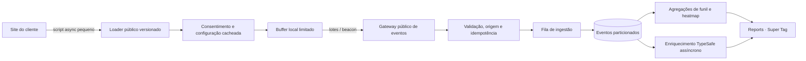

# Plano de evolução da Cadu Super Tag

**Status:** plano de evolução com primeira versão funcional em desenvolvimento no módulo Reports.
**Escopo:** runtime público da Super Tag, URLs públicas de instalação, coleta de eventos, audiência anônima, formulários, navegação, conversões, funis e mapas de visibilidade/cliques.

## 1. Resumo executivo

A base existente já tem um coletor útil de **Funnel Flow**. O arquivo `aicentralv2/static/cadu_connect/cadu-flow-tag.js` registra page views, heartbeat, envio de formulário sem conteúdo, cliques, cliques de WhatsApp e navegação SPA. O backend associa eventos a fluxos, páginas e campanhas.

A **Super Tag ainda não é um serviço independente funcional**. `reports_flow.py` retorna `supertag: None` nas URLs públicas; a interface pode criar uma tag marcada `supertag`, mas não há um runtime público separado e seu endpoint de coleta está acoplado a Fluxos. Tampouco há identificação de audiência persistente por cookie ou eventos de visibilidade/mapa de calor.

O plano cria dois artefatos e contratos separados:

1. **Cadu Super Tag:** medição first-party configurável por site/cliente, com audiência anônima consentida, navegação, formulários, conversões e heatmaps agregados.
2. **Funnel Flow:** definição e análise dos caminhos de campanha, referenciando eventos e etapas capturados pela Super Tag. Continua sendo uma configuração de fluxo, não um segundo coletor.

O primeiro corte implementa instalações independentes por domínio, snippet e configuração pública no domínio atual `https://reports.centralcomm.media`, consentimento explícito, coleta em lotes, deduplicação, limites, eventos básicos e resumos para Reports. A fila distribuída, expurgo físico por política de retenção e renderização visual de heatmaps permanecem etapas seguintes.

O runtime do navegador deve permanecer pequeno, síncrono apenas no essencial e sem chamadas de IA. A coleta será agrupada e enfileirada; TypeSafe atuará em tarefas assíncronas para sugerir semântica de páginas, eventos e conversões, com revisão humana quando houver incerteza.

## 2. Estado encontrado

| Área | Existe hoje | Lacuna para a Super Tag proposta |
|---|---|---|
| URL do script | `/static/cadu_connect/cadu-flow-tag.js?client=…` e snippet individual por `CF_…` | URL e versão pública próprias para Super Tag; configuração independente por site |
| Identidade | UUID em `sessionStorage`, limitado à sessão e à chave do fluxo | modo de audiência anônima persistente com consentimento, expiração, revogação e controles |
| Eventos | Página, heartbeat, form submit genérico, click genérico, WhatsApp, evento customizado | visibilidade, profundidade de rolagem, interação com elementos e coleta configurável de campos |
| Privacidade | Não envia valores de formulário; sanitiza paths no servidor e guarda host do referrer | consentimento, retenção/deleção de identificadores, inventário e política configurável por site |
| Coleta | Uma chamada `fetch` por evento; inserção síncrona no banco; lookups de tag, fluxo e passos no caminho da requisição | lote, fila, idempotência, configuração cacheada, limites por site e processamento desacoplado |
| Conversões e fluxo | Mapas de passos por URL; atribuição por UTMs/IDs e associação a campanhas | regras de conversão reutilizáveis no nível do site e funil ligado a eventos estáveis |
| Heatmap | Não encontrado no código revisado | armazenamento agregado de click/visibility, sem replay bruto de DOM |
| TypeSafe | Usado na sugestão de colunas de importação; não participa do runtime público | enriquecer páginas/eventos de forma assíncrona, com evidência e confiança preservadas |

O código atual também substitui `history.pushState` diretamente e envia um heartbeat a cada 30 segundos por aba. Esses comportamentos devem ser substituídos por instrumentação que não interfira no site e por heartbeat adaptativo baseado em visibilidade/atividade.

## 3. Objetivos e limites

### Objetivos

- Entender origem de tráfego, páginas vistas, sequência de etapas, conversões, formulários e cliques por campanha.
- Medir audiência anônima em contexto first-party, com consentimento e prazo de retenção configuráveis.
- Produzir mapas agregados de cliques, visibilidade e rolagem que ajudem a melhorar páginas de conversão.
- Entregar um único snippet leve por site; selecionar configurações, domínios e fluxos pelo `site_id` público.
- Evitar que falha da coleta, do banco, de TypeSafe ou da rede afete a renderização do site do cliente.
- Manter Super Tag e Google Ads Script como integrações separadas. Super Tag observa eventos do site; Google Ads importa e envia métricas da plataforma.

### Limites de privacidade e produto

- Não fazer fingerprinting de dispositivo, canvas, fontes ou IP para reidentificar pessoas.
- Não enviar nomes, e-mails, telefones, texto digitado, conteúdo de campos ou dados de saúde/financeiros por padrão.
- Não capturar DOM inteiro, screenshots automáticos ou gravação de sessão na primeira versão.
- Não usar TypeSafe para reconhecer ou decidir a identidade de visitantes.
- Não tratar um ID anônimo como prova de identidade ou consentimento.

## 4. Arquitetura-alvo



### Componentes

1. **Loader público:** JavaScript minificado, versionado e imutável. Inicializa sem bloquear renderização; não baixa dependências externas.
2. **Configuração pública:** regras não secretas do site (domínios, consentimento, eventos permitidos, amostragem, versão do schema). Cacheável por `site_id + config_version`.
3. **Gateway de coleta:** valida origem/domínio permitido, tamanho, esquema, quota e assinatura/chave pública de instalação. Responde rapidamente após enfileirar.
4. **Fila:** separa resposta HTTP da escrita/normalização. Repetições são seguras por `event_id` e chave de deduplicação.
5. **Armazenamento:** evento bruto mínimo com retenção limitada; tabelas/agregados separados para audiência, sessões, passos, conversões e heatmaps.
6. **Processadores:** resolvem URL→passo, origem→campanha, sessão→funil e pontos de heatmap fora da resposta web.
7. **TypeSafe:** sugere classificações de páginas e eventos sobre metadados sanitizados. Resultados guardam a evidência, a distribuição/confiança e o estado de revisão.

## 5. URLs públicas e contratos de instalação

### 5.1 URL de runtime da Super Tag

Expor uma URL independente do Funnel Flow, por exemplo:

```text
https://reports.centralcomm.media/static/cadu_connect/cadu-supertag-v1.js
```

Snippet proposto:

```html
<script async src="https://reports.centralcomm.media/static/cadu_connect/cadu-supertag-v1.js"
  data-cadu-site="SITE_PUBLIC_ID"
  data-cadu-config="https://reports.centralcomm.media/connect/public/supertag/v1/SITE_PUBLIC_ID/config.json"></script>
```

O endpoint de coleta correspondente é `https://reports.centralcomm.media/connect/public/supertag/v1/SITE_PUBLIC_ID/collect`. O domínio permitido do site é validado pelo servidor via `Origin`; a configuração pública só expõe opções de instalação e não contém credenciais privadas.

- `SITE_PUBLIC_ID` identifica configuração pública, não é segredo nem autorização para ler dados.
- A escrita continua protegida por origem permitida, limites, validação, mitigação de abuso e chave rotacionável quando necessária.
- Não incluir dados pessoais, campaign IDs privados, token de sessão nem chave administrativa na URL.
- Um cliente pode manter um site e vários domínios explicitamente permitidos, com opção de chave/configuração por ambiente.
- URLs de instalação devem ser estáveis; os arquivos servidos por versão devem ter cache de longa duração e hash no nome/caminho.

### 5.2 URL do coletor

Preferir endpoint first-party, quando o cliente puder configurá-lo:

```text
https://events.cliente.com/cadu/v1/collect
```

O destino pode ser um proxy/CNAME gerenciado para a Cadu. Como fallback, usar endpoint Cadu com CORS estrito, `OPTIONS` cacheado e allowlist de origem. O browser recebe somente a informação necessária para emitir eventos; credenciais privilegiadas ficam sempre no servidor.

### 5.3 URL do Funnel Flow

Manter separado, com contrato explícito e associação ao site:

```text
https://reports.centralcomm.media/static/cadu_connect/cadu-flow-tag.js?client=CLIENT_ID
data-cadu-flow="CF_XXXXXXX"
```

O mesmo runtime-base pode compartilhar utilitários internos, mas os bundles, configuração, permissões e APIs públicas devem ser versionáveis e revogáveis separadamente. A URL antiga de Flow continua compatível durante migração e deve ser retirada só após medir instalações ativas.

### 5.4 Configuração/cache público

`GET /v1/sites/{site_id}/config/{config_version}.json` retorna apenas configuração publicada. Headers sugeridos: `Cache-Control: public, max-age=31536000, immutable` para versão imutável; configuração corrente retorna `ETag` e TTL curto. Revogação usa nova versão e bloqueio server-side no gateway.

## 6. Runtime de navegador e desempenho

### Carregamento

- Bundle inicial meta: **até 8 KB gzip**; módulo de heatmap fica em chunk opcional, carregado só se habilitado e após consentimento.
- `async`, sem CSS/iframe, sem fonte/imagem de terceiros, sem monkey patch global obrigatório e sem tarefas longas no thread principal.
- Inicialização só lê configuração e instala listeners leves; não varre todo o DOM. Captura de elementos usa delegação de eventos.
- APIs opcionais (`IntersectionObserver`, `requestIdleCallback`, `sendBeacon`) precisam de fallback sem impedir o funcionamento da página.
- O loader deve falhar fechado e silenciosamente: erro de rede não deve produzir erro não tratado nem atrasar interação.

### Envio

- Buffer por aba: lote por tamanho/tempo (ponto inicial a medir: até 10 eventos ou 5 segundos), com prioridade para page view, conversão e submit.
- Em `pagehide`/`visibilitychange`, tentar `navigator.sendBeacon`; fallback `fetch(..., keepalive: true)`. Limitar bytes por lote e número de tentativas.
- Enviar identificador único por evento, timestamp e versão de esquema; deduplicar no gateway/worker.
- `IntersectionObserver` registra apenas transições relevantes (ex.: 25/50/75/100% visível) e limita repetições por elemento/sessão.
- Heatmap usa amostragem configurável e coordenadas normalizadas por viewport; não guarda texto do elemento ou seletor que contenha dados digitados.
- Reduzir heartbeat para sinal adaptativo de atividade/visibilidade; não transmitir evento periódico a cada 30s quando a aba está oculta.

### Metas de serviço para validar em piloto

São alvos iniciais, não medições atuais:

| Indicador | Meta inicial |
|---|---:|
| Loader em cache, transferido | ≤ 8 KB gzip |
| Trabalho síncrono do loader | p75 ≤ 20 ms em dispositivo móvel de referência |
| Impacto de LCP/INP atribuível à tag | sem regressão mensurável; limite de piloto ≤ 50 ms p75 |
| Requisições de coleta | no máximo 1 por lote, sem chamada separada para cada clique |
| Aceite no gateway | p95 ≤ 150 ms, incluindo validação/enfileiramento |
| Disponibilidade de ingestão | ≥ 99,9% mensal, com perdas medidas e alerta |
| Configuração pública | cache hit ≥ 95% após aquecimento |

Medir com RUM sintético e páginas reais, rede lenta e CPU móvel limitada. Tamanho, amostragem e frequência devem ser ajustados com tráfego piloto.

## 7. Identidade anônima, cookies e audiência

### Modos explícitos por site

1. **Essencial/sem analytics:** sem cookie persistente e sem audiência entre páginas; métricas estritamente agregadas podem depender da configuração legal do cliente.
2. **Analytics consentido:** ID aleatório first-party, cookie com expiração configurável, rotacionável e sem significado fora da Cadu. Sessão tem ID distinto e prazo curto.
3. **Sem armazenamento disponível:** fallback para ID de sessão em memória/session storage; não tentar reconstruir identidade com fingerprint.

### Regras

- Respeitar CMP/Consent Mode existente via evento ou API documentada; manter analytics desabilitado até receber o estado aplicável.
- Estados separados: `unknown`, `denied`, `granted`; não inferir consentimento pela instalação do script.
- Cookie restrito ao domínio/site quando possível (`Secure`, `SameSite=Lax`, duração limitada). Um domínio de coleta CNAME melhora o contexto first-party, mas não contorna consentimento, políticas do navegador ou bloqueadores.
- Oferecer rotação/revogação de ID, exclusão por visitante e política de retenção por site. Não persistir IP completo; se proteção antifraude exigir tratamento transitório, documentar e descartar após decisão.
- Guardar o mínimo para atribuição: referrer host, UTMs permitidas e click IDs autorizados pelo cliente; remover query strings arbitrárias e sanitizar paths antes da persistência.
- Não vincular formulário ou CRM a identidade anônima sem autorização e ação explícita do cliente; registrar a base da associação e origem do evento.

## 8. Eventos e contratos de dados

Envelope versão 1:

```json
{
  "schema_version": 1,
  "site_id": "public-id",
  "event_id": "uuid",
  "visitor_id": "uuid-ou-null",
  "session_id": "uuid",
  "occurred_at": "ISO-8601",
  "kind": "page_view",
  "page": {"path": "/inscricao", "referrer_host": "busca.exemplo"},
  "attribution": {"source": "google", "medium": "cpc", "campaign": "verao"},
  "consent": {"analytics": "granted"},
  "context": {"viewport": "mobile", "flow_code": "CF_ABC1234"}
}
```

- `context` aceita somente chaves permitidas por contrato; limitar cardinalidade e tamanho.
- Formulário padrão registra `form_id`, página e resultado (`submit`, `success`, `error`), nunca os valores.
- Campos de formulário selecionados explicitamente podem enviar somente valores enumerados e não sensíveis, com mascaramento/validação no browser e servidor; por padrão essa capacidade fica desligada.
- Conversão recebe um tipo, ID de evento e opcionalmente valor/moeda; CRM associa por token próprio server-to-server, não copiando e-mail/telefone para a Super Tag.
- Cliques guardam classe de ação (`cta`, `whatsapp`, `nav`, `other`) e identificador configurado; não guardar texto livre inteiro do botão.
- Cada evento terá política de expiração e suporte para deduplicação/reprocessamento.

## 9. Heatmaps e análise de navegação

### Primeira versão

- **Click map:** coordenadas normalizadas por viewport e bucket de dispositivo; preferir ID/atributo `data-cadu-element` definido pelo cliente. Fallback com seletor CSS estável sanitizado; sem texto, valor de campo ou conteúdo do DOM.
- **Visibility map:** elemento instrumentado com `data-cadu-element` ou lista configurada; registrar percentual de visibilidade e tempo em faixas, usando `IntersectionObserver`.
- **Scroll map:** profundidade máxima em degraus de 25%, um evento por degrau por sessão/página.
- **Filtros:** URL mapeada, campanha/origem, dispositivo, período e consentimento/estado de amostragem.
- **Agregação:** células espaciais (ex.: grid normalizado) e buckets de visibilidade no worker; exibir somente grupos acima de um limite mínimo de visitantes.
- **Preview:** heatmap sobre screenshot enviado pelo usuário ou captura autorizada; não fazer screenshot silencioso nem sessão replay na versão inicial.

### Qualidade analítica

- Versão de viewport e layout vinculada ao agregado para evitar sobrepor posições de páginas muito diferentes.
- Remover do conjunto elementos dentro de formulários, áreas privadas, iframes bancários e seletores configurados como sensíveis.
- Exibir amostra e intervalo de datas junto ao mapa; não transformar heatmap em afirmação causal sobre conversão.

## 10. Funis, URLs e atribuição

- Normalizar URLs para `origin + path` e remover query string e fragmento do identificador da etapa; guardar UTMs/click IDs em campos separados e allowlisted.
- Suportar regra por igualdade, prefixo e expressão simples versionada; precedência determinística para rota mais específica.
- Mapear páginas de entrada, formulário, etapa intermediária, WhatsApp e conversão final. O cliente pode definir conversão por URL, evento ou callback de sucesso do formulário.
- Construir sessões ordenadas no servidor e calcular taxa entre passos, abandono, tempo entre etapas e origens. Separar conversões de plataforma, evento observado e confirmação do CRM.
- Atribuição deve indicar método (`explicit_campaign_id`, `utm_id`, regra da URL, referrer ou não atribuído) e janela configurada. Nunca associar campanha só porque a página é compartilhada por várias campanhas.
- Alterações do fluxo geram versões; evento histórico mantém a versão/configuração usada ao recebê-lo.

## 11. Aplicações seguras do TypeSafe

TypeSafe não entra na carga crítica da Super Tag. Suas decisões rodam em background, com metadados minimizados e código como autoridade final.

| Julgamento assíncrono | Estado permitido | Uso do resultado |
|---|---|---|
| Tipo provável da página | path sanitizado, title revisado/opcional, estrutura sem texto de usuário e páginas/etapas existentes | sugerir `landing`, `form`, `checkout`, `thank_you`, `content`, `other`; o cliente confirma publicação |
| Intenção de conversão da etapa | regra, path e configuração do site | sugerir conversão candidata; nunca ativar medição sem revisão/configuração explícita |
| Correspondência evento→taxonomia | nomes de eventos, schema e dicionário conhecido | sugerir normalização; manter o nome e valor originais como evidência sanitizada |
| Qualidade de mapeamento de funil | etapas ordenadas, páginas e contagens agregadas | apontar etapa possivelmente ausente ou URL duplicada para revisão |
| Sinal de dado potencialmente pessoal | nomes de propriedades e metadados de esquema, sem valores submetidos | marcar propriedade para revisão/bloqueio; não inspecionar campos do visitante em tempo real |

Fazer perguntas independentes em um único fan-out quando compartilham o mesmo estado; manter um resultado `none/uncertain` para não forçar classificação. Persistir escolha, probabilidades e confiança de `Choice`/`Score`; calibrar limites com páginas reais antes de automatizar recomendações. Baixa confiança vira revisão, e a publicação permanece uma ação explícita. A documentação TypeSafe recomenda perguntas tipadas, fan-out para avaliações paralelas e limites de confiança conforme o risco; essas recomendações orientam o desenho, não certificam a precisão no domínio Cadu.

## 12. Modelo de dados proposto

- `cadu_supertag_sites`: site, escopo organization/client, configuração, domínios permitidos, estado, versão publicada, sampling e retenção.
- `cadu_supertag_site_keys`: chaves públicas de instalação com rotação/revogação e ambientes; hash armazenado quando a chave puder autorizar ingestão.
- `cadu_supertag_consents`: ID pseudônimo, categorias, estado, momento e versão da política, com retenção reduzida.
- `cadu_supertag_visitors` e `cadu_supertag_sessions`: IDs aleatórios, primeira/última visita e atribuição mínima; sem perfil demográfico inferido.
- `cadu_supertag_events`: evento versionado, idempotency key, site/session/visitor, timestamp, path sanitizado, campanha, etapa e payload allowlisted.
- `cadu_supertag_heatmap_cells`: agregados por site, path/layout version, viewport, célula/elemento, evento e período.
- `cadu_supertag_config_versions`: snapshot imutável de consentimento, regras de URL, eventos e passos publicados.
- `cadu_supertag_ai_suggestions`: classificação, evidência, modelo, probabilidades/confiança, estado de revisão e versão de configuração.

Aplicar isolamento organization/client em chaves estrangeiras e consultas, índices por `(site_id, occurred_at)`, `(site_id, session_id, occurred_at)` e `(site_id, path_hash, occurred_at)`. Planejar particionamento temporal e retenção antes de alto volume; agregados devem sobreviver por mais tempo que eventos brutos quando a política permitir.

## 13. Segurança, abuso e governança

- Allowlist de host com normalização de IDNA, portas e subdomínios explícitos; validar host declarado e origem quando disponível. `Origin` é uma pista de navegador, não mecanismo de autenticação suficiente.
- Segredos de escrita e credenciais internas jamais aparecem em query string, HTML ou configuração do browser. Chaves públicas são revogáveis e limitadas por site.
- CORS com origem exata, métodos/headers mínimos e cache de preflight; limite por site, IP efêmero, tamanho, frequência e cardinalidade.
- Descartar payloads desconhecidos, campos pessoais e paths com tokens; validar novamente no servidor.
- Proteção contra spam/replay com `event_id`, quotas, amostragem adaptativa e detecção de tráfego automatizado sem fingerprint invasivo.
- Ferramentas de cliente: preview de dados, exportação, exclusão e auditoria de consentimento/revogação; controles de acesso por cliente.
- Definir retenção por classe de dado, fluxo de atendimento de exclusão e indicadores de perda, atraso, rejeição e duplicação.

## 14. Plano de execução por fases

### Fase 0 — Contrato e compatibilidade

- Inventariar instalações de Funnel Flow e tags ativas antes de alterar URLs.
- Definir schema de eventos, consentimento, domínios, limite de payload e política de retenção.
- Documentar que Flow e Super Tag são serviços distintos; congelar contrato legado e criar telemetria de migração.
- **Saída:** ADR aprovado, schema versionado e matriz de compatibilidade.

### Fase 1 — Super Tag mínima e URL pública

- Criar `supertag.min.js` versionado e endpoint público de configuração.
- Criar site ID público, domínios permitidos, publicação/pausa/revogação e chave/configuração independente de Flow.
- Manter funções básicas de page view, navegação SPA por observação não invasiva, clique e form submit sem valores.
- Introduzir consent states e modo de audiência sem persistência como padrão inicial; habilitar cookie anônimo somente com configuração/consentimento.
- **Aceite:** snippet independente funciona sem usuário autenticado e sem chave secreta no browser; Flow antigo continua coletando durante migração.

### Fase 2 — Gateway rápido e coleta em lote

- Adicionar endpoint de ingestão versionado, schema validation, idempotência e quotas.
- Adicionar buffer, lote, `sendBeacon`/fallback e fila; evitar consultas a fluxo/configuração em cada evento.
- Cachear configuração publicada e reduzir consultas síncronas a validação essencial.
- Medir impacto no site e atingir metas da seção 6 antes de abrir rollout amplo.
- **Aceite:** duplicatas de lote não duplicam métrica; indisponibilidade do gateway não quebra a página; latência e perdas têm dashboard/alerta.

### Fase 3 — Audiência e consentimento

- Integrar CMP via API estável e registrar preferências/categoria/versão da política.
- Adicionar cookie first-party aleatório, rotação, expiração, revoke e mecanismos de exclusão.
- Criar relatórios de audiência, sessão recorrente e atribuição com limiares de agregação.
- **Aceite:** negar analytics interrompe persistência não essencial; revogar exclui ou torna inutilizável o identificador conforme política definida.

### Fase 4 — Conversões e Funnel Flow

- Criar biblioteca versionada de regras de URL e eventos customizados da Super Tag.
- Ligar regras de conversão a `CF_…` sem acoplar identidade do visitante a uma campanha presumida.
- Criar visualização de jornada, taxa de passagem, abandono e tempo entre etapas.
- **Aceite:** conversão por URL, evento e CRM são separáveis e exibem método/janela de atribuição.

### Fase 5 — Formulários e heatmaps

- Registrar somente metadados de formulário por padrão; introduzir allowlist para campos não sensíveis se houver caso aprovado.
- Adicionar scroll/visibility e click heatmaps agregados, com amostragem, viewport/layout version e exclusão de elementos sensíveis.
- Adicionar retenção e mínimo de visitantes para exibir mapa.
- **Aceite:** payload não contém valores livres nem texto do DOM; usuário consegue identificar amostra, período e dispositivo do heatmap.

### Fase 6 — TypeSafe e recomendações revisáveis

- Processar URLs/eventos/metadados sanitizados fora da ingestão síncrona.
- Usar `Choice`, `Score` e `Noul` somente em julgamentos com taxonomia e critérios explícitos; incluir saída sem correspondência.
- Guardar evidência, distribuição/confiança, versão do estado e decisão humana; thresholds avaliados com amostra Cadu.
- Sugerir mapeamentos e inconsistências; manter aprovação humana para publicar conversão ou alterar configuração de coleta.
- **Aceite:** falha/timeout TypeSafe não afeta ingestão; recomendações são rastreáveis e reversíveis.

### Fase 7 — Escala e migração

- Migrar snippets de Flow em ondas, medindo cobertura e falhas por versão.
- Ativar partições, agregações/materialized views, retenção e replay da fila conforme volume real.
- Aposentar URL antiga apenas após período de compatibilidade, aviso no painel e queda confirmada das instalações antigas.
- **Aceite:** rollback por versão de script/configuração; painel mostra versões antigas ainda ativas e taxa de migração.

## 15. Observabilidade e validação

- Browser: carregamento/erro do script, duração de inicialização, bytes enviados, buffer descartado, consentimento, versão e navegador; sem registrar identificador bruto nos logs.
- Gateway: requests/s, p50/p95/p99, 4xx por motivo, 429, falhas de fila, atraso, duplicatas e origem bloqueada.
- Dados: eventos por tipo, cobertura de página→sessão→passo→conversão, cardinalidade, taxa de audiência consentida e heatmap utilizável.
- Produto: contribuição da tag no LCP/INP em piloto, dashboards de conversão e feedback de instrumentação.
- Casos mínimos: consent denied/granted, bloqueio de cookie, SPA, formulário sem valores, WhatsApp, conversão, página não mapeada, domínio inválido, envio duplicado, request offline, payload malformado, tag revogada e TypeSafe indisponível.
- Fazer rollout em sites internos e clientes opt-in, comparar com contadores existentes e revisar falsos positivos de eventos antes de declarar cobertura completa.

## 16. Decisões a fechar antes da implementação

1. Quais categorias de consentimento e regras por jurisdição o produto adotará?
2. Quanto tempo manter eventos detalhados, sessões pseudônimas e agregados de heatmap?
3. O cliente terá de configurar CNAME/proxy first-party ou haverá fallback padrão na Cadu?
4. Quais campos de formulário, se algum, serão elegíveis para allowlist e em quais setores ficam proibidos?
5. Qual volume inicial por site e limite de eventos/minuto serão usados para dimensionar fila, banco e preço?
6. A configuração de Flow será uma camada sobre eventos da Super Tag ou manterá compatibilidade com o coletor legado por uma janela definida?

## 17. Referências

- Código revisado: `aicentralv2/static/cadu_connect/cadu-flow-tag.js`, `aicentralv2/cadu_connect/reports_flow.py`, `frontend/reports-v1/main.jsx`, `migrations/add_reports_funnel_management_v1.sql` e `migrations/add_reports_operations_v1.sql`.
- TypeSafe: [mapa de casos de uso](https://docs.typesafe.ai/concepts/use-case-map), [fan-out de perguntas](https://docs.typesafe.ai/patterns/fan-out), [confiança e incerteza](https://docs.typesafe.ai/confidence), [API](https://docs.typesafe.ai/api).
