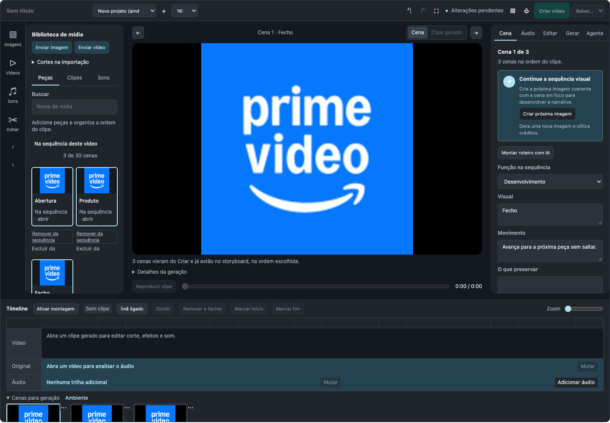
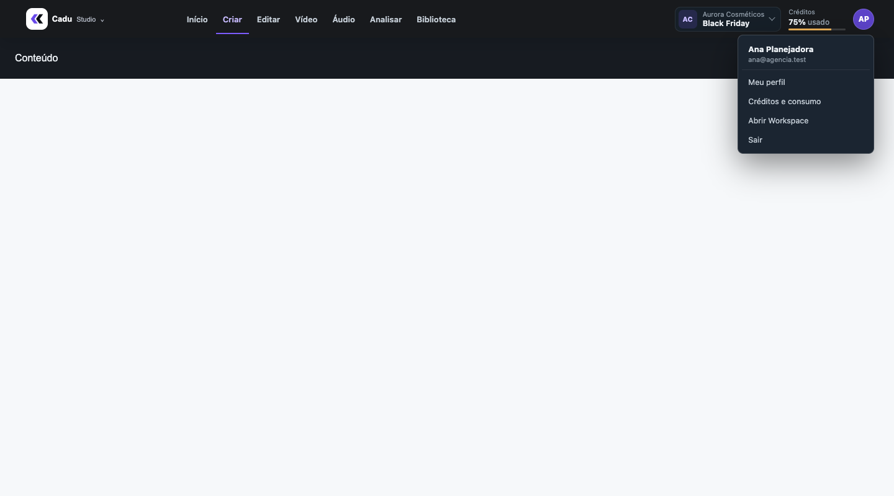
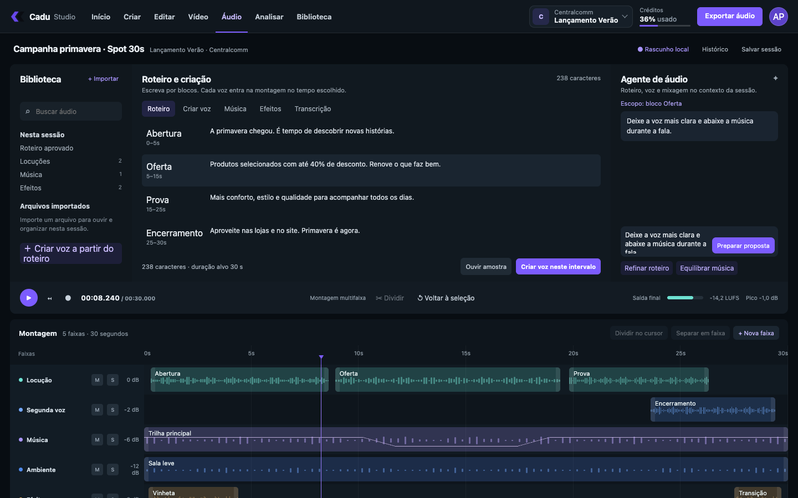
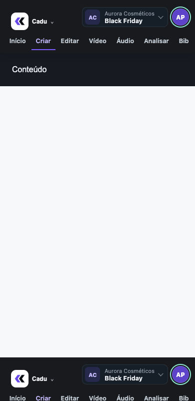
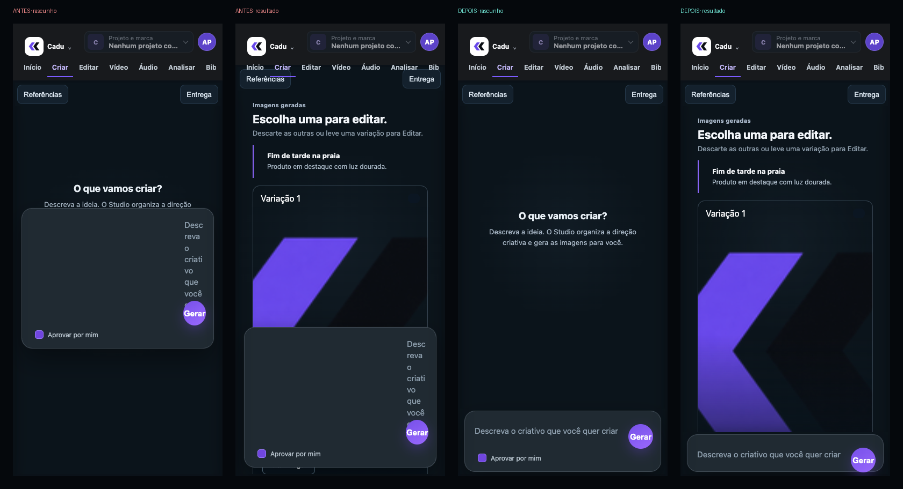
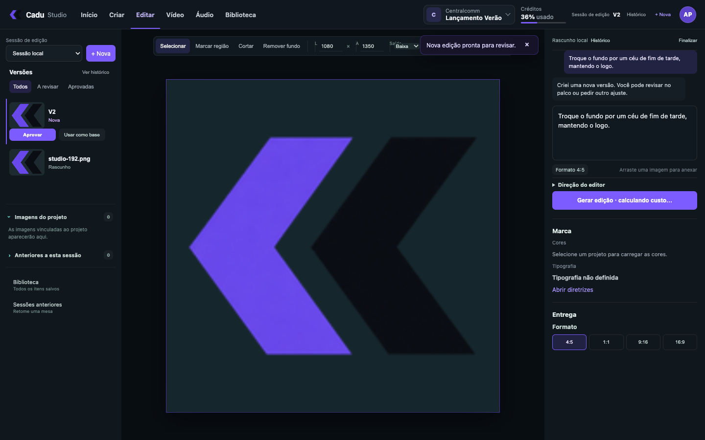

# Relatório de testes — Cadu Studio (2026-10-02)

Comando único: `npm run test:studio` → **saída 0 (tudo verde)**.

| Suíte | Antes | Agora |
|---|---|---|
| Python (`tests/test_studio_*.py`, `tests/test_video_studio*.py`) | 149 ok / 3 falhas | **157 ok / 0 falhas** |
| Biblioteca do Studio (node:test) | ok | **6 ok** |
| Editor de vídeo — abas 390–1440px, filmstrip, texto, sons | ok* | **PASS** |
| Fluxo do editor — timeline, áudio, legendas, keyframes, export, cortes | ok* | **PASS** |
| Downloads MP4/GIF/HTML | ok* | **PASS** |
| **Novo:** Criar → Vídeo (navegador) | — | **PASS** |
| **Novo:** `send-to-video` (5 testes Python) | — | **PASS** |

\* Antes passavam usando uma página de teste congelada em `tmp/` e um Playwright de outra ferramenta
(`~/.cache/codex-runtimes`). Agora usam o Playwright do projeto e geram a página a partir do template atual
a cada execução — ou seja, testam o código de verdade.

## O que foi corrigido nos testes antigos
- Chave de segurança renomeada (`trocr_csrf_token` → `studio_csrf_token`) — 2 testes de vídeo.
- Teste de export interceptava o arquivo errado (a rota mudou para `creative_media/studio.py`).
- Navbar: o estado ativo mudou de fundo verde para sublinhado roxo; o teste foi alinhado.

## O que o teste Criar → Vídeo garante
- 3 imagens enviadas chegam ao storyboard **na ordem escolhida** (captura abaixo: "Cena 1 de 3").
- 1 imagem abre pronta para animar.
- Imagem que não está na biblioteca mostra aviso, sem quebrar a tela.
- O parâmetro sai da URL depois de usado; nenhum erro de JavaScript.

## Fora da suíte (registrado)
- `tests/frontend/mc-studio-browser.cjs` — home **legada** (`parametros/modelagem_criativos.html`):
  já falhava antes destas mudanças; será substituída na Fase 7.
- Analisador de criativos: fora do escopo por decisão (backend PHP virá depois). O teste visual dele passa.

---

# Rodada 2 — correções de prompt, biblioteca única e navbar única

`npm run test:studio` → **saída 0**. Python **162 ok**; navegador **7 suítes PASS**.

| Novo teste | O que garante |
|---|---|
| Prompt do diretor (Criar) | teto de tokens 4.000 + 1.200 por direção e raciocínio "low" no gpt-5-nano (antes 1.220 podia vir vazio) |
| Voz da locução (Vídeo) | roteiro longo não apaga mais a direção do narrador; tudo cabe em 400 caracteres |
| Compilador do Editar | quando volta ao pedido original, diz o motivo (`literal_changed`, `provider_error`…) e qual texto protegido foi alterado |
| Clipe pronto → biblioteca única | todo vídeo concluído entra em `cx_studio_assets`; falha no registro nunca derruba o job |
| Navbar única (página Jinja) | 7 ferramentas, item ativo, troca de projeto passa pelo contrato antigo e dispara `cadu:project-change`, créditos, menu de conta, 390px sem rolagem |
| Navbar única (Editor e Áudio React) | mesmas 7 ferramentas e o mesmo seletor/créditos nos apps React |

Backfill da biblioteca única aplicado no banco: **11 imagens + 6 clipes**.

---

# Rodada 3 — Editor sem Untitled, bug de segurança do Editor e estabilidade visual do Criar

`npm run test:studio` → **saída 0**. Python **166 ok** · navegador **9 suítes PASS** · testes relacionados **312 ok**.

## Bug corrigido: o Editor era recusado pelo servidor
O Editor enviava o token do Trocr no cabeçalho `X-CSRF-Token`, mas upload, sessões e tarefas de edição
exigem o token do Studio em `X-Trocr-CSRF-Token`. Reproduzido: **403** antes, **200** depois.
A cotação (`/format-lab/quote`) só aceitava equipe interna; agora aceita contas do Studio (com login).

## Editor
- CSS caiu de **392 KB para 47 KB** (saiu o design system com estilos do Untitled); visual **idêntico pixel a pixel**.
- Diálogo próprio do kit (`StudioDialog`).
- **Novo teste de fluxo:** enviar peça → pedir edição → nova versão, conferindo o token em todas as chamadas.

## Criar — estabilidade visual medida (CLS, limite "bom" 0,1)
| Largura | Antes | Depois |
|---|---|---|
| 1440px | 0,016–0,143 (instável) | **0,018** |
| 1024px | 0,028–0,208 (instável) | **0,031** |
| 768px | 0,028–0,154 (instável) | **0,007–0,042** |
| 390px | **0,362** | **0,014** |

Causas encontradas e corrigidas:
1. Campo do pedido esmagado no celular (regras em camadas jogavam o texto na coluna de 44px do botão).
2. Compositor flutuando por cima do conteúdo no celular → agora acompanha o fluxo, preso ao rodapé.
3. Cabeçalho espremido pelo layout de 100dvh quando o resultado cresce (salto de 0,264).
4. Página rearranjada pelo JS depois de aparecer → agora só aparece pronta (com revelação automática de segurança).
5. Área de trabalho podia "escorregar" para baixo do cabeçalho ao focar um botão (`overflow:hidden` → `clip`).

**Novo teste do Criar:** fluxo completo em 4 larguras, revisão manual da direção, erro do provedor
preservando o briefing, botões do resultado clicáveis e CLS < 0,1 obrigatório.

